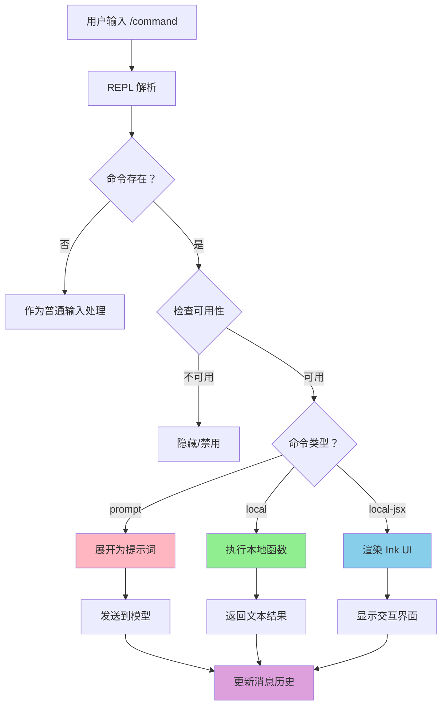
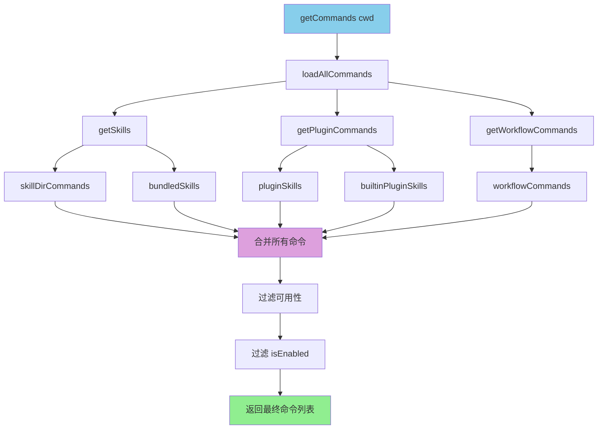
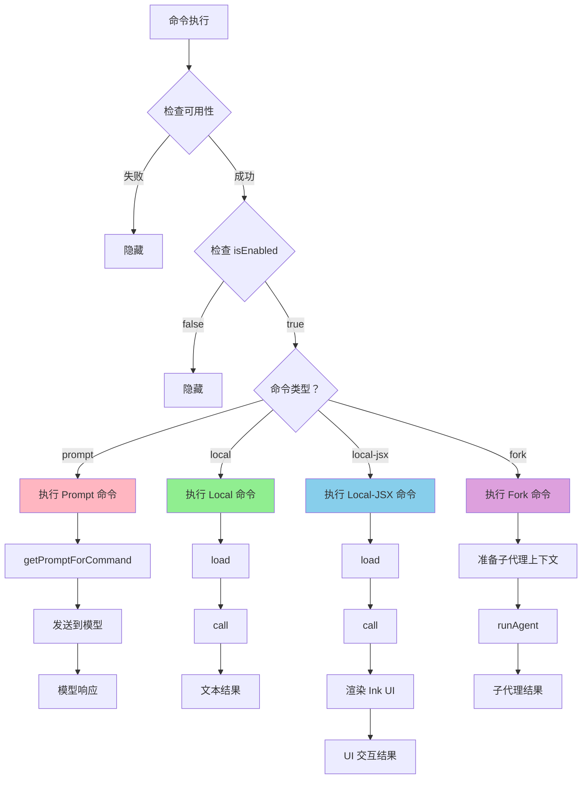
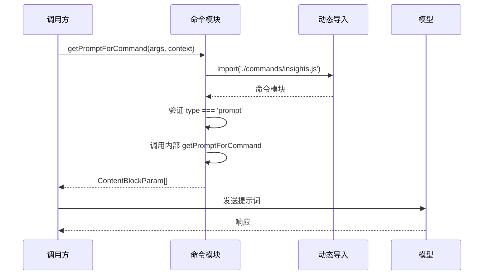
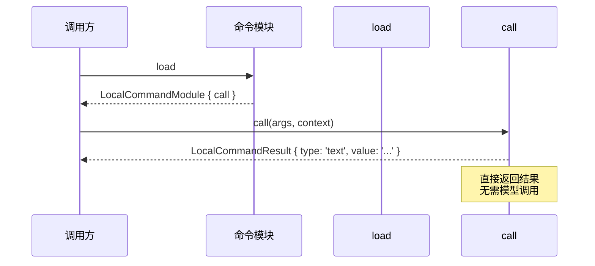
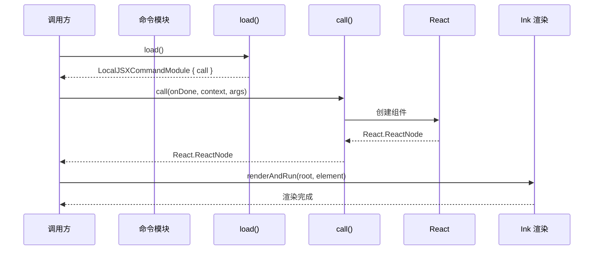
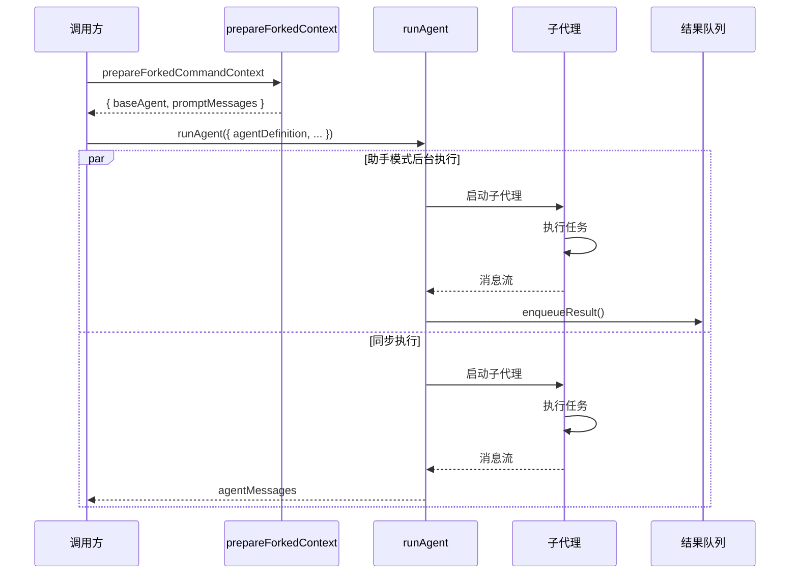
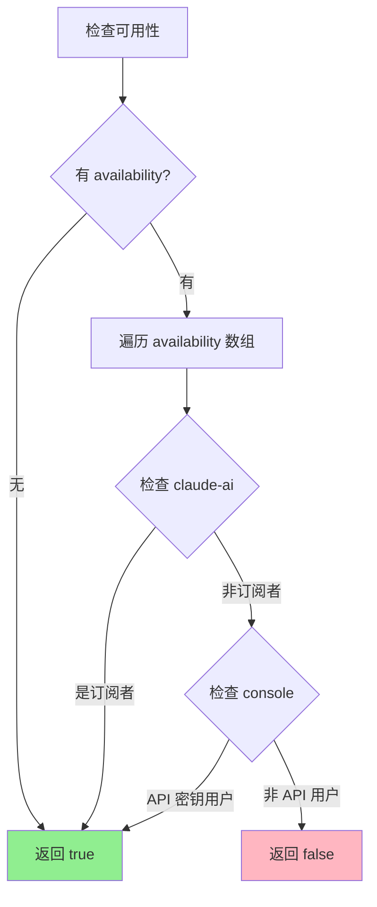
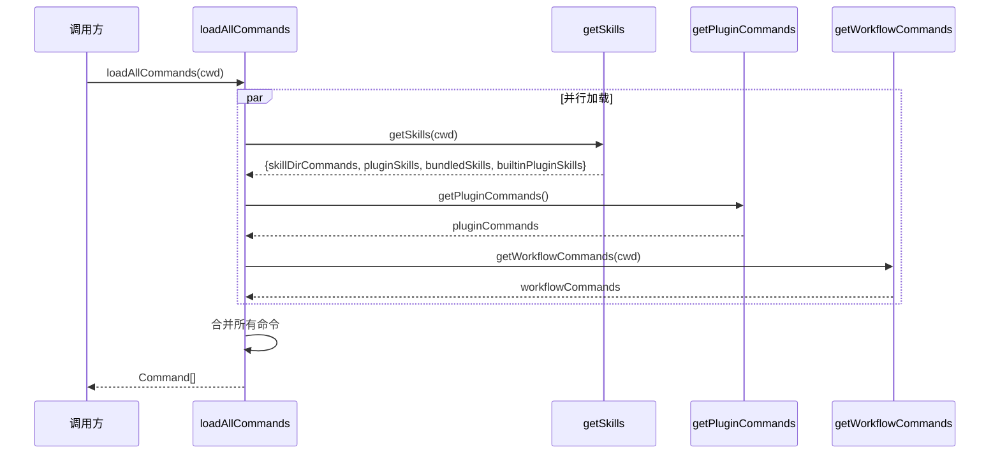

# Yao Code 命令系统详解

> 文档版本：1.0  
> 生成日期：2026-04-01  
> 基于源码：`src/commands.ts`, `src/types/command.ts`, `src/utils/processUserInput/processSlashCommand.tsx`, `src/screens/REPL.tsx`

---

## 目录

1. [命令系统概述](#1-命令系统概述)
2. [命令类型系统](#2-命令类型系统)
3. [命令注册表架构](#3-命令注册表架构)
4. [命令执行流程](#4-命令执行流程)
5. [Prompt 命令执行详解](#5-prompt-命令执行详解)
6. [Local 命令执行详解](#6-local-命令执行详解)
7. [Local-JSX 命令执行详解](#7-local-jsx-命令执行详解)
8. [Fork 模式命令执行](#8-fork-模式命令执行)
9. [命令可用性系统](#9-命令可用性系统)
10. [动态命令加载](#10-动态命令加载)
11. [典型命令案例分析](#11-典型命令案例分析)

---

## 1. 命令系统概述

### 1.1 设计哲学

Claude Code 的命令系统采用**多态设计**，根据命令的执行方式和输出形式分为三种类型：

> **核心原则**: 命令的执行方式应该与其目的匹配 —— 简单的文本输出使用 local 类型，复杂 UI 交互使用 local-jsx 类型，需要模型智能处理的使用 prompt 类型。

### 1.2 命令分类与职责

| 命令类型 | 执行环境 | 输出形式 | 典型用途 |
|----------|----------|----------|----------|
| `prompt` | 模型调用 | 文本提示词 | 技能调用、复杂任务 |
| `local` | 本地执行 | 纯文本 | 版本查询、简单操作 |
| `local-jsx` | 本地执行 | React 组件 (Ink) | 帮助界面、配置对话框 |

### 1.3 命令系统总览



---

## 2. 命令类型系统

### 2.1 类型定义

**文件**: `src/types/command.ts`

```typescript
// 命令基础接口
export type CommandBase = {
  availability?: CommandAvailability[]  // 可用性 (claude-ai / console)
  description: string                    // 描述
  isEnabled?: () => boolean              // 是否启用
  isHidden?: boolean                     // 是否隐藏
  name: string                           // 名称
  aliases?: string[]                     // 别名
  argumentHint?: string                  // 参数提示
  whenToUse?: string                     // 使用场景
}

// Prompt 命令：模型可调用
export type PromptCommand = {
  type: 'prompt'
  progressMessage: string                // 进度消息
  contentLength: number                  // 内容长度 (字符)
  argNames?: string[]                    // 参数名
  allowedTools?: string[]                // 允许的工具
  model?: string                         // 指定模型
  source: SettingSource | 'builtin' | 'mcp' | 'plugin' | 'bundled'
  getPromptForCommand(
    args: string,
    context: ToolUseContext,
  ): Promise<ContentBlockParam[]>        // 获取提示词
}

// Local 命令：本地执行，文本输出
type LocalCommand = {
  type: 'local'
  supportsNonInteractive: boolean        // 是否支持非交互模式
  load: () => Promise<LocalCommandModule>
}

type LocalCommandCall = (
  args: string,
  context: LocalJSXCommandContext,
) => Promise<LocalCommandResult>

// Local-JSX 命令：本地执行，UI 渲染
type LocalJSXCommand = {
  type: 'local-jsx'
  load: () => Promise<LocalJSXCommandModule>
}

type LocalJSXCommandCall = (
  onDone: LocalJSXCommandOnDone,
  context: ToolUseContext & LocalJSXCommandContext,
  args: string,
) => Promise<React.ReactNode>
```

### 2.2 命令结果类型

```typescript
// Local 命令结果
export type LocalCommandResult =
  | { type: 'text'; value: string }      // 文本结果
  | { type: 'compact'; compactionResult: CompactionResult }  // 压缩结果
  | { type: 'skip' }                     // 跳过显示

// 命令结果显示方式
export type CommandResultDisplay = 'skip' | 'system' | 'user'
```

### 2.3 命令类型对比

| 特性 | prompt | local | local-jsx |
|------|--------|-------|-----------|
| **执行环境** | 模型 | 本地 | 本地 |
| **输出形式** | ContentBlockParam[] | 文本 | ReactNode |
| **异步加载** | 否 | 是 (`load()`) | 是 (`load()`) |
| **UI 渲染** | 否 | 否 | 是 (Ink) |
| **模型调用** | 是 | 否 | 否 |
| **典型用途** | 技能、复杂任务 | 简单查询 | 配置、帮助 |
| **执行成本** | 高 (API 调用) | 低 | 中 (UI 渲染) |

---

## 3. 命令注册表架构

### 3.1 注册表结构

**文件**: `src/commands.ts` (755 行)

```typescript
// 命令注册表结构
const COMMANDS = memoize((): Command[] => [
  // 基础命令 (30+)
  addDir, advisor, agents, branch, btw, chrome, clear, color,
  compact, config, copy, desktop, context, cost, diff, doctor,
  // ...
  
  // 条件命令 (feature flag 控制)
  ...(proactive ? [proactive] : []),
  ...(briefCommand ? [briefCommand] : []),
  ...(assistantCommand ? [assistantCommand] : []),
  ...(bridge ? [bridge] : []),
  // ...
  
  // 认证相关命令
  ...(!isUsing3PServices() ? [logout, login()] : []),
])
```

### 3.2 命令分类列表

| 类别 | 命令数量 | 示例 |
|------|----------|------|
| **基础命令** | 30+ | `/help`, `/clear`, `/config` |
| **Git 命令** | 5+ | `/commit`, `/review`, `/branch` |
| **技能命令** | 动态 | `/skills`, `/memory` |
| **MCP 命令** | 动态 | `/mcp` |
| **插件命令** | 动态 | `/plugin`, `/reload-plugins` |
| **条件命令** | 15+ | `/assistant`, `/bridge`, `/voice` |

### 3.3 条件命令 (Feature Flag 控制)

```typescript
// src/commands.ts:62-122

// KAIROS (助手模式)
const assistantCommand = feature('KAIROS')
  ? require('./commands/assistant/index.js').default
  : null

// BRIDGE_MODE (远程桥接)
const bridge = feature('BRIDGE_MODE')
  ? require('./commands/bridge/index.js').default
  : null

// VOICE_MODE (语音模式)
const voiceCommand = feature('VOICE_MODE')
  ? require('./commands/voice/index.js').default
  : null

// WORKFLOW_SCRIPTS (工作流脚本)
const workflowsCmd = feature('WORKFLOW_SCRIPTS')
  ? require('./commands/workflows/index.js').default
  : null

// FORK_SUBAGENT (子代理分叉)
const forkCmd = feature('FORK_SUBAGENT')
  ? require('./commands/fork/index.js').default
  : null

// BUDDY (伙伴通知)
const buddy = feature('BUDDY')
  ? require('./commands/buddy/index.js').default
  : null
```

### 3.4 命令加载架构



### 3.5 动态命令来源

```typescript
// src/commands.ts:449-469
const loadAllCommands = memoize(async (cwd: string): Promise<Command[]> => {
  const [
    { skillDirCommands, pluginSkills, bundledSkills, builtinPluginSkills },
    pluginCommands,
    workflowCommands,
  ] = await Promise.all([
    getSkills(cwd),           // 技能目录命令
    getPluginCommands(),      // 插件命令
    getWorkflowCommands ? getWorkflowCommands(cwd) : Promise.resolve([]),
  ])

  return [
    ...bundledSkills,         // 捆绑技能
    ...builtinPluginSkills,   // 内置插件技能
    ...skillDirCommands,      // 技能目录命令
    ...workflowCommands,      // 工作流命令
    ...pluginCommands,        // 插件命令
    ...pluginSkills,          // 插件技能
    ...COMMANDS(),            // 内置命令
  ]
})
```

---

## 4. 命令执行流程

### 4.1 命令执行总时序图

```mermaid
sequenceDiagram
    participant User as 用户
    participant REPL as REPL.tsx
    participant Parse as processSlashCommand.tsx
    participant Cmd as 命令模块
    participant Engine as QueryEngine
    participant Model as 模型 API
    participant UI as Ink UI
    
    User->>REPL: 输入 /command args
    REPL->>Parse: processSlashCommand()
    
    Parse->>Parse: 解析命令名和参数
    Parse->>Parse: 查找命令定义
    
    alt 命令不存在
        Parse-->>REPL: 作为普通输入处理
    else 命令存在
        Parse->>Parse: 检查可用性 (meetsAvailabilityRequirement)
        Parse->>Parse: 检查 isEnabled()
        
        alt 不可用/禁用
            Parse-->>REPL: 隐藏/跳过
        else 可用
            Parse->>Parse{命令类型？}
            
            opt prompt 类型
                Parse->>Cmd: getPromptForCommand(args, context)
                Cmd-->>Parse: ContentBlockParam[]
                Parse->>Engine: 提交到模型
                Engine->>Model: API 调用
                Model-->>Engine: 响应
                Engine-->>REPL: 更新消息
            end
            
            opt local 类型
                Parse->>Cmd: load()
                Cmd-->>Parse: LocalCommandModule
                Parse->>Cmd: call(args, context)
                Cmd-->>Parse: LocalCommandResult
                Parse-->>REPL: 显示文本结果
            end
            
            opt local-jsx 类型
                Parse->>Cmd: load()
                Cmd-->>Parse: LocalJSXCommandModule
                Parse->>Cmd: call(onDone, context, args)
                Cmd-->>Parse: React.ReactNode
                Parse->>UI: 渲染组件
                UI-->>REPL: 显示交互界面
            end
        end
    end
```

### 4.2 命令解析流程

**文件**: `src/utils/processUserInput/processSlashCommand.tsx`

```typescript
// 命令解析主函数
async function processSlashCommand(
  input: string,
  context: ProcessUserInputContext,
): Promise<ProcessUserInputResult> {
  // 1. 解析斜杠命令语法
  const parsed = parseSlashCommand(input)
  
  // 2. 查找命令定义
  const commands = await context.getCommands()
  const command = findCommand(parsed.commandName, commands)
  
  if (!command) {
    // 命令不存在，作为普通输入处理
    return { /* ... */ }
  }
  
  // 3. 检查可用性
  if (!meetsAvailabilityRequirement(command)) {
    return { /* 隐藏 */ }
  }
  
  // 4. 检查是否启用
  if (command.isEnabled && !command.isEnabled()) {
    return { /* 隐藏 */ }
  }
  
  // 5. 根据类型执行
  switch (command.type) {
    case 'prompt':
      return executePromptCommand(command, parsed.args, context)
    case 'local':
      return executeLocalCommand(command, parsed.args, context)
    case 'local-jsx':
      return executeLocalJSXCommand(command, parsed.args, context)
    case 'fork':
      return executeForkedCommand(command, parsed.args, context)
  }
}
```

### 4.3 命令类型决策树



---

## 5. Prompt 命令执行详解

### 5.1 Prompt 命令特点

Prompt 命令是**模型可调用**的命令类型，执行时会展开为文本提示词发送给模型。

### 5.2 执行流程

```typescript
// src/commands.ts:53-57 (PromptCommand 定义)
export type PromptCommand = {
  type: 'prompt'
  progressMessage: string
  contentLength: number
  // ...
  async getPromptForCommand(args, context) {
    const real = (await import('./commands/insights.js')).default
    if (real.type !== 'prompt') throw new Error('unreachable')
    return real.getPromptForCommand(args, context)
  }
}
```

### 5.3 典型 Prompt 命令：insights

```typescript
// src/commands.ts:190-202
const usageReport: Command = {
  type: 'prompt',
  name: 'insights',
  description: 'Generate a report analyzing your Yao Code sessions',
  contentLength: 0,
  progressMessage: 'analyzing your sessions',
  source: 'builtin',
  async getPromptForCommand(args, context) {
    const real = (await import('./commands/insights.js')).default
    if (real.type !== 'prompt') throw new Error('unreachable')
    return real.getPromptForCommand(args, context)
  }
}
```

### 5.4 Prompt 命令执行时序



### 5.5 Prompt 命令的 Fork 模式

Prompt 命令支持在**子代理**中执行：

```typescript
// src/types/command.ts:42-48
export type PromptCommand = {
  // ...
  // 执行上下文：'inline'(默认) 或 'fork'(子代理)
  context?: 'inline' | 'fork'
  // 分叉时使用的代理类型
  agent?: string
  effort?: EffortValue
}
```

---

## 6. Local 命令执行详解

### 6.1 Local 命令特点

Local 命令在**本地执行**，返回文本结果，不经过模型。

### 6.2 典型 Local 命令：version

```typescript
// src/commands/version.ts
import type { Command, LocalCommandCall } from '../types/command.js'

const call: LocalCommandCall = async () => {
  return {
    type: 'text',
    value: MACRO.BUILD_TIME
      ? `${MACRO.VERSION} (built ${MACRO.BUILD_TIME})`
      : MACRO.VERSION,
  }
}

const version = {
  type: 'local',
  name: 'version',
  description: 'Print the version this session is running',
  isEnabled: () => process.env.USER_TYPE === 'ant',
  supportsNonInteractive: true,
  load: () => Promise.resolve({ call }),
} satisfies Command
```

### 6.3 Local 命令执行流程



### 6.4 Local 命令结果处理

```typescript
// src/types/command.ts:16-23
export type LocalCommandResult =
  | { type: 'text'; value: string }           // 文本结果
  | { type: 'compact'; compactionResult: CompactionResult }  // 压缩结果
  | { type: 'skip' }                          // 跳过显示
```

---

## 7. Local-JSX 命令执行详解

### 7.1 Local-JSX 命令特点

Local-JSX 命令在**本地执行**，渲染 React 组件到终端 (使用 Ink 库)。

### 7.2 典型 Local-JSX 命令：help

```typescript
// src/commands/help/index.ts
import type { Command } from '../../commands.js'

const help = {
  type: 'local-jsx',
  name: 'help',
  description: 'Show help and available commands',
  load: () => import('./help.js'),
} satisfies Command

export default help
```

```typescript
// src/commands/help/help.tsx
import * as React from 'react'
import { HelpV2 } from '../../components/HelpV2/HelpV2.js'
import type { LocalJSXCommandCall } from '../../types/command.js'

export const call: LocalJSXCommandCall = async (
  onDone,
  { options: { commands } }
) => {
  return <HelpV2 commands={commands} onClose={onDone} />
}
```

### 7.3 Local-JSX 命令执行流程



### 7.4 onDone 回调机制

```typescript
// src/types/command.ts:107-126
export type LocalJSXCommandOnDone = (
  result?: string,
  options?: {
    display?: CommandResultDisplay    // 'skip' | 'system' | 'user'
    shouldQuery?: boolean             // 是否发送到模型
    metaMessages?: string[]           // 元消息
    nextInput?: string                // 下一个输入
    submitNextInput?: boolean         // 是否提交下一个输入
  }
) => void
```

---

## 8. Fork 模式命令执行

### 8.1 Fork 模式概述

Fork 模式将命令在**子代理**中执行，适用于需要独立上下文和 token 预算的命令。

### 8.2 执行函数

**文件**: `src/utils/processUserInput/processSlashCommand.tsx`

```typescript
// 执行分叉的斜杠命令
async function executeForkedSlashCommand(
  command: CommandBase & PromptCommand,
  args: string,
  context: ProcessUserInputContext,
  precedingInputBlocks: ContentBlockParam[],
  setToolJSX: SetToolJSXFn,
  canUseTool: CanUseToolFn,
): Promise<SlashCommandResult> {
  // 1. 创建代理 ID
  const agentId = createAgentId()
  
  // 2. 准备分叉命令上下文
  const {
    skillContent,
    modifiedGetAppState,
    baseAgent,
    promptMessages,
  } = await prepareForkedCommandContext(command, args, context)
  
  // 3. 合并 effort 设置
  const agentDefinition = command.effort !== undefined
    ? { ...baseAgent, effort: command.effort }
    : baseAgent
  
  // 4. 收集代理消息
  const agentMessages: Message[] = []
  
  // 5. 运行代理
  for await (const message of runAgent({
    agentDefinition,
    promptMessages,
    toolUseContext: { ...context, getAppState: modifiedGetAppState },
    canUseTool,
    isAsync: true,
    querySource: 'agent:custom',
  })) {
    agentMessages.push(message)
  }
  
  // 6. 提取结果文本
  const resultText = extractResultText(agentMessages, 'Command completed')
  
  return {
    messages: [],
    shouldQuery: false,
    command,
  }
}
```

### 8.3 助手模式下的后台执行

```typescript
// src/utils/processUserInput/processSlashCommand.tsx:102-183
// 助手模式：fire-and-forget，后台启动子代理
if (feature('KAIROS') && (await context.getAppState()).kairosEnabled) {
  const bgAbortController = createAbortController()
  const commandName = getCommandName(command)
  
  // 捕获当前 workload 用于结果归因
  const spawnTimeWorkload = getWorkload()
  
  // 将结果重新入队为隐藏提示
  const enqueueResult = (value: string): void => enqueuePendingNotification({
    value,
    mode: 'prompt',
    priority: 'later',
    isMeta: true,
    skipSlashCommands: true,
    workload: spawnTimeWorkload,
  })
  
  // 后台执行
  void (async () => {
    // 等待 MCP 服务器稳定
    const deadline = Date.now() + MCP_SETTLE_TIMEOUT_MS
    while (Date.now() < deadline) {
      const s = context.getAppState()
      if (!s.mcp.clients.some(c => c.type === 'pending')) break
      await sleep(MCP_SETTLE_POLL_MS)
    }
    
    // 运行代理
    const freshTools = context.options.refreshTools?.() ?? context.options.tools
    const agentMessages: Message[] = []
    
    for await (const message of runAgent({
      agentDefinition,
      promptMessages,
      toolUseContext: { ...context, getAppState: modifiedGetAppState },
      availableTools: freshTools,
    })) {
      agentMessages.push(message)
    }
    
    const resultText = extractResultText(agentMessages, 'Command completed')
    
    // 重新入队结果
    enqueueResult(`<scheduled-task-result command="/${commandName}">\n${resultText}\n</scheduled-task-result>`)
  })().catch(err => {
    logError(err)
    enqueueResult(`<scheduled-task-result command="/${commandName}" status="failed">\n${err.message}\n</scheduled-task-result>`)
  })
  
  // 立即返回，不阻塞
  return {
    messages: [],
    shouldQuery: false,
    command,
  }
}
```

### 8.4 Fork 模式执行时序



### 8.5 MCP 服务器等待逻辑

```typescript
// MCP 服务器稳定等待
const MCP_SETTLE_POLL_MS = 200
const MCP_SETTLE_TIMEOUT_MS = 10_000

const deadline = Date.now() + MCP_SETTLE_TIMEOUT_MS
while (Date.now() < deadline) {
  const s = context.getAppState()
  if (!s.mcp.clients.some(c => c.type === 'pending')) break
  await sleep(MCP_SETTLE_POLL_MS)
}
```

**设计原理**:
> MCP 服务器通常在启动后 1-3 秒内连接；10 秒的余量覆盖慢速 SSE 握手。后台分叉子代理在启动时会获取 MCP 服务器状态，避免在服务器未连接时执行。

---

## 9. 命令可用性系统

### 9.1 可用性类型

```typescript
// src/types/command.ts:169-173
export type CommandAvailability =
  | 'claude-ai'    // claude.ai OAuth 订阅用户
  | 'console'      // Console API 密钥用户
```

### 9.2 可用性检查函数

```typescript
// src/commands.ts:417-443
export function meetsAvailabilityRequirement(cmd: Command): boolean {
  if (!cmd.availability) return true
  
  for (const a of cmd.availability) {
    switch (a) {
      case 'claude-ai':
        if (isClaudeAISubscriber()) return true
        break
      case 'console':
        // Console API 密钥用户 = 直接 1P API 客户
        if (
          !isClaudeAISubscriber() &&
          !isUsing3PServices() &&
          isFirstPartyAnthropicBaseUrl()
        )
          return true
        break
      default: {
        const _exhaustive: never = a
        void _exhaustive
        break
      }
    }
  }
  return false
}
```

### 9.3 可用性与启用的区别

```typescript
// src/types/command.ts:155-163
export type CommandBase = {
  // availability = 谁可以使用 (认证/提供商要求，静态)
  availability?: CommandAvailability[]
  
  // isEnabled() = 当前是否启用 (GrowthBook, 平台，环境变量)
  isEnabled?: () => boolean
  
  // isHidden = 是否从类型ahead/帮助中隐藏
  isHidden?: boolean
}
```

### 9.4 可用性决策流程



---

## 10. 动态命令加载

### 10.1 技能命令加载

```typescript
// src/commands.ts:353-398
async function getSkills(cwd: string): Promise<{
  skillDirCommands: Command[]
  pluginSkills: Command[]
  bundledSkills: Command[]
  builtinPluginSkills: Command[]
}> {
  try {
    const [skillDirCommands, pluginSkills] = await Promise.all([
      getSkillDirCommands(cwd).catch(err => {
        logError(toError(err))
        return []
      }),
      getPluginSkills().catch(err => {
        logError(toError(err))
        return []
      }),
    ])
    
    // 捆绑技能在启动时同步注册
    const bundledSkills = getBundledSkills()
    const builtinPluginSkills = getBuiltinPluginSkillCommands()
    
    return {
      skillDirCommands,
      pluginSkills,
      bundledSkills,
      builtinPluginSkills,
    }
  } catch (err) {
    logError(toError(err))
    return {
      skillDirCommands: [],
      pluginSkills: [],
      bundledSkills: [],
      builtinPluginSkills: [],
    }
  }
}
```

### 10.2 插件命令加载

```typescript
// src/utils/plugins/loadPluginCommands.ts
export async function getPluginCommands(): Promise<Command[]> {
  const plugins = await loadAllPluginsCacheOnly()
  
  const commands: Command[] = []
  for (const plugin of plugins.enabled) {
    if (plugin.commands) {
      commands.push(...plugin.commands)
    }
  }
  
  return commands
}
```

### 10.3 MCP 命令加载

```typescript
// src/commands.ts:547-559
export function getMcpSkillCommands(
  mcpCommands: readonly Command[],
): readonly Command[] {
  if (feature('MCP_SKILLS')) {
    return mcpCommands.filter(
      cmd =>
        cmd.type === 'prompt' &&
        cmd.loadedFrom === 'mcp' &&
        !cmd.disableModelInvocation,
    )
  }
  return []
}
```

### 10.4 动态命令去重

```typescript
// src/commands.ts:476-517
export async function getCommands(cwd: string): Promise<Command[]> {
  const allCommands = await loadAllCommands(cwd)
  const dynamicSkills = getDynamicSkills()
  
  // 构建基础命令列表
  const baseCommands = allCommands.filter(
    _ => meetsAvailabilityRequirement(_) && isCommandEnabled(_),
  )
  
  if (dynamicSkills.length === 0) {
    return baseCommands
  }
  
  // 去重动态技能
  const baseCommandNames = new Set(baseCommands.map(c => c.name))
  const uniqueDynamicSkills = dynamicSkills.filter(
    s =>
      !baseCommandNames.has(s.name) &&
      meetsAvailabilityRequirement(s) &&
      isCommandEnabled(s),
  )
  
  // 插入到插件技能之后、内置命令之前
  const builtInNames = new Set(COMMANDS().map(c => c.name))
  const insertIndex = baseCommands.findIndex(c => builtInNames.has(c.name))
  
  if (insertIndex === -1) {
    return [...baseCommands, ...uniqueDynamicSkills]
  }
  
  return [
    ...baseCommands.slice(0, insertIndex),
    ...uniqueDynamicSkills,
    ...baseCommands.slice(insertIndex),
  ]
}
```

### 10.5 动态命令加载时序



---

## 11. 典型命令案例分析

### 11.1 `/help` - Local-JSX 命令

**文件**: `src/commands/help/`

```typescript
// index.ts
const help = {
  type: 'local-jsx',
  name: 'help',
  description: 'Show help and available commands',
  load: () => import('./help.js'),
} satisfies Command

// help.tsx
export const call: LocalJSXCommandCall = async (onDone, { options: { commands } }) => {
  return <HelpV2 commands={commands} onClose={onDone} />
}
```

**特点**:
- 渲染 React 组件到终端
- 显示所有可用命令列表
- 支持搜索和导航

### 11.2 `/version` - Local 命令

**文件**: `src/commands/version.ts`

```typescript
const call: LocalCommandCall = async () => {
  return {
    type: 'text',
    value: MACRO.BUILD_TIME
      ? `${MACRO.VERSION} (built ${MACRO.BUILD_TIME})`
      : MACRO.VERSION,
  }
}

const version = {
  type: 'local',
  name: 'version',
  description: 'Print the version this session is running',
  isEnabled: () => process.env.USER_TYPE === 'ant',
  supportsNonInteractive: true,
  load: () => Promise.resolve({ call }),
} satisfies Command
```

**特点**:
- 直接返回文本结果
- 仅 ant 用户可用
- 支持非交互模式

### 11.3 `/insights` - Prompt 命令

**文件**: `src/commands/insights.ts`

```typescript
const usageReport: Command = {
  type: 'prompt',
  name: 'insights',
  description: 'Generate a report analyzing your Yao Code sessions',
  contentLength: 0,
  progressMessage: 'analyzing your sessions',
  source: 'builtin',
  async getPromptForCommand(args, context) {
    const real = (await import('./commands/insights.js')).default
    return real.getPromptForCommand(args, context)
  }
}
```

**特点**:
- 懒加载重型模块 (113KB)
- 展开为模型提示词
- 分析会话历史

### 11.4 命令类型对比总结

| 命令 | 类型 | 加载方式 | 执行方式 | 输出形式 |
|------|------|----------|----------|----------|
| `/help` | local-jsx | 动态导入 | 本地渲染 | Ink UI |
| `/version` | local | Promise.resolve | 本地执行 | 文本 |
| `/insights` | prompt | 动态导入 | 模型调用 | 提示词 |
| `/commit` | prompt | 动态导入 | 模型调用 | 提示词 |
| `/mcp` | local-jsx | 动态导入 | 本地渲染 | Ink UI |
| `/skills` | local-jsx | 动态导入 | 本地渲染 | Ink UI |

---

## 12. 总结

### 12.1 命令系统架构总结

Claude Code 的命令系统是一个**多态、可扩展的命令执行框架**：

1. **三种命令类型**: prompt、local、local-jsx，各司其职
2. **动态加载**: 技能、插件、MCP 命令按需加载
3. **可用性控制**: 基于认证状态的细粒度访问控制
4. **Fork 模式**: 支持子代理执行，独立上下文和 token 预算
5. **特征标志**: 基于 feature() 的死代码消除

### 12.2 关键设计决策

| 决策 | 理由 |
|------|------|
| 多态命令类型 | 匹配不同执行需求 |
| 懒加载 | 减少启动时间 |
| 并行加载 | 提高加载效率 |
| 可用性检查 | 支持多认证模式 |
| Fork 模式 | 隔离复杂任务执行 |

### 12.3 相关文件索引

| 文件 | 职责 |
|------|------|
| `src/commands.ts` | 命令注册表 (755 行) |
| `src/types/command.ts` | 命令类型定义 |
| `src/utils/processUserInput/processSlashCommand.tsx` | 命令解析和执行 |
| `src/screens/REPL.tsx` | REPL 主循环 |
| `src/QueryEngine.ts` | 查询引擎 |

---

## 附录：命令完整列表

### 内置命令 (部分)

```
/help, /clear, /config, /login, /logout, /mcp, /skills, /memory,
/tasks, /commit, /review, /branch, /status, /usage, /cost,
/theme, /vim, /keybindings, /plugins, /reload-plugins, ...
```

### 条件命令

```
/assistant (KAIROS), /bridge (BRIDGE_MODE), /voice (VOICE_MODE),
/ultraplan (ULTRAPLAN), /fork (FORK_SUBAGENT), /buddy (BUDDY), ...
```

### 动态命令

```
/skills/* (技能目录), /plugins/* (插件), /mcp/* (MCP 服务器), ...
```
