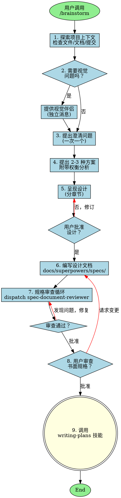

# Superpowers:Brainstorming Skill 详细分析文档

## 1. 概述

`superpowers:brainstorming` 是 Yao Code 中一个内置的规划型技能 (bundled skill)，用于将用户的想法转化为完整的设计和规格说明。该技能通过交互式对话引导用户逐步明确需求，最终生成结构化的设计文档。

### 1.1 技能定位

| 属性 | 值 |
|------|-----|
| **技能名称** | `superpowers:brainstorming` |
| **技能类型** | Bundled Skill (内置技能) |
| **执行模式** | Inline (在当前对话中执行) |
| **所属插件** | `superpowers` (官方插件) |
| **主要用途** | 需求分析、设计规划、规格说明生成 |

---

## 2. 系统架构

### 2.1 整体架构图

```
┌─────────────────────────────────────────────────────────────────────────┐
│                         Yao Code 主系统                               │
├─────────────────────────────────────────────────────────────────────────┤
│                                                                          │
│  ┌──────────────┐    ┌──────────────┐    ┌──────────────────────────┐  │
│  │  用户输入     │    │  SkillTool   │    │   技能执行引擎            │  │
│  │  /brainstorm │───▶│  验证/权限   │───▶│  processPromptSlashCmd   │  │
│  └──────────────┘    └──────────────┘    └──────────────────────────┘  │
│         │                   │                        │                  │
│         │                   │                        │                  │
│         ▼                   ▼                        ▼                  │
│  ┌─────────────────────────────────────────────────────────────────┐   │
│  │                    Brainstorming Skill Prompt                    │   │
│  │  ┌────────────────────────────────────────────────────────────┐  │   │
│  │  │  Step 1: 探索项目上下文                                     │  │   │
│  │  │  Step 2: 提供视觉伴侣 (可选)                                 │  │   │
│  │  │  Step 3: 澄清问题 (一次一个)                                  │  │   │
│  │  │  Step 4: 提出 2-3 种方案                                      │  │   │
│  │  │  Step 5: 呈现设计并获取批准                                   │  │   │
│  │  │  Step 6: 编写设计文档                                         │  │   │
│  │  │  Step 7: 规格审查循环                                         │  │   │
│  │  │  Step 8: 用户审查书面规格                                     │  │   │
│  │  │  Step 9: 过渡到 writing-plans 技能                           │  │   │
│  │  └────────────────────────────────────────────────────────────┘  │   │
│  └─────────────────────────────────────────────────────────────────┘   │
│                                  │                                      │
│                                  ▼                                      │
│  ┌─────────────────────────────────────────────────────────────────┐   │
│  │                        输出产物                                  │   │
│  │  docs/superpowers/specs/YYYY-MM-DD-<topic>-design.md            │   │
│  └─────────────────────────────────────────────────────────────────┘   │
│                                                                          │
└─────────────────────────────────────────────────────────────────────────┘
```

### 2.2 核心组件关系

```
┌────────────────────────────────────────────────────────────────────────┐
│                        组件依赖关系图                                   │
└────────────────────────────────────────────────────────────────────────┘

                    ┌─────────────────────┐
                    │   bootstrap-entry   │
                    │      (启动入口)      │
                    └──────────┬──────────┘
                               │
                               ▼
                    ┌─────────────────────┐
                    │   initBundledSkills │
                    │   (初始化内置技能)   │
                    └──────────┬──────────┘
                               │
                               ▼
                    ┌─────────────────────┐
                    │  registerBundledSkill│
                    │   (技能注册器)       │
                    └──────────┬──────────┘
                               │
                               ▼
        ┌──────────────────────┴──────────────────────┐
        │                                             │
        ▼                                             ▼
┌───────────────────┐                     ┌───────────────────┐
│  superpowers 插件  │                     │   其他内置技能     │
│  SKILL.md 文件     │                     │  (simplify 等)    │
└───────────────────┘                     └───────────────────┘
        │                                             │
        └──────────────────────┬──────────────────────┘
                               │
                               ▼
                    ┌─────────────────────┐
                    │     SkillTool       │
                    │   (技能执行工具)     │
                    └──────────┬──────────┘
                               │
                               ▼
                    ┌─────────────────────┐
                    │  processPromptSlash │
                    │  (处理斜杠命令)      │
                    └──────────┬──────────┘
                               │
                               ▼
                    ┌─────────────────────┐
                    │  AskUserQuestion    │
                    │  (用户问答工具)      │
                    └─────────────────────┘
```

---

## 3. 代码调用流程

### 3.1 技能注册流程

```typescript
// 文件：src/skills/bundled/index.ts

export function initBundledSkills(): void {
  // ... 其他技能注册 ...
  
  // superpowers 插件中的技能通过插件系统自动注册
  // 插件在加载时会自动发现并注册 SKILL.md 文件
}
```

```typescript
// 文件：src/skills/loadSkillsDir.ts

async function loadSkillsFromSkillsDir(
  basePath: string,
  source: SettingSource,
): Promise<SkillWithPath[]> {
  // 1. 读取技能目录
  const entries = await fs.readdir(basePath)
  
  // 2. 遍历每个子目录
  for (const entry of entries) {
    // 3. 读取 SKILL.md 文件
    const skillFilePath = join(skillDirPath, 'SKILL.md')
    const content = await fs.readFile(skillFilePath, { encoding: 'utf-8' })
    
    // 4. 解析 frontmatter 和内容
    const { frontmatter, content: markdownContent } = parseFrontmatter(content)
    
    // 5. 创建技能命令对象
    const skill = createSkillCommand({
      skillName: entry.name,
      markdownContent,
      source,
      baseDir: skillDirPath,
      loadedFrom: 'skills',
    })
    
    results.push({ skill, filePath: skillFilePath })
  }
}
```

### 3.2 技能执行时序图

```
┌──────┐    ┌───────────┐    ┌────────────┐    ┌─────────────┐    ┌───────────┐    ┌────────────┐
│ 用户  │    │ SkillTool │    │ 验证/权限  │    │ 命令处理器  │    │ 技能 Prompt │    │ AskUserQuestion│
└──┬───┘    └─────┬─────┘    └─────┬──────┘    └──────┬──────┘    └─────┬─────┘    └──────┬─────┘
   │              │                │                  │               │                 │
   │ /brainstorm  │                │                  │               │                 │
   │─────────────▶│                │                  │               │                 │
   │              │                │                  │               │                 │
   │              │ validateInput  │                  │               │                 │
   │              │───────────────▶│                  │               │                 │
   │              │                │                  │               │                 │
   │              │   ✅ 验证通过   │                  │               │                 │
   │              │◀───────────────│                  │               │                 │
   │              │                │                  │               │                 │
   │              │ checkPermissions                 │               │                 │
   │              │───────────────▶│                  │               │                 │
   │              │                │                  │               │                 │
   │              │   ✅ 权限批准   │                  │               │                 │
   │              │◀───────────────│                  │               │                 │
   │              │                │                  │               │                 │
   │              │ call()         │                  │               │                 │
   │              │─────────────────────────────────▶│               │                 │
   │              │                │                  │               │                 │
   │              │                │ processPromptSlashCommand()     │                 │
   │              │                │─────────────────▶│               │                 │
   │              │                │                  │               │                 │
   │              │                │                  │ 注入技能 Prompt │                 │
   │              │                │                  │──────────────▶│                 │
   │              │                │                  │               │                 │
   │              │                │                  │ ◀─────────────│                 │
   │              │                │                  │ 返回消息列表   │                 │
   │              │                │◀─────────────────│               │                 │
   │              │◀───────────────│                  │               │                 │
   │              │                │                  │               │                 │
   │              │                │                  │               │ 开始执行        │
   │              │                │                  │               │────────────────▶│
   │              │                │                  │               │                 │
   │              │                │                  │               │ 探索项目上下文   │
   │              │                │                  │               │ (Glob/Grep/Read)│
   │              │                │                  │               │                 │
   │              │                │                  │               │ 提问澄清问题     │
   │              │                │                  │               │────────────────▶│
   │              │                │                  │               │                 │
   │              │                │                  │               │ ◀───────────────│
   │              │                │                  │               │ 用户回答        │
   │              │                │                  │               │                 │
   │              │                │                  │               │ ... 迭代多轮     │
   │              │                │                  │               │                 │
   │              │                │                  │               │ 编写设计文档     │
   │              │                │                  │ Write 文件    │                 │
   │              │                │                  │──────────────▶│                 │
   │              │                │                  │               │                 │
   │              │                │                  │ 调用 writing-plans              │
   │              │                │                  │────────────────────────────────▶│
   │              │                │                  │                                 │
   │ ◀─────────────────────────────────────────────────────────────────────────────────│
   │ 设计文档已生成                                                                           │
   │                                                                                      │
```

### 3.3 详细执行流程

```typescript
// 文件：src/tools/SkillTool/SkillTool.ts

async function call(
  { skill, args },
  context,
  canUseTool,
  parentMessage,
  onProgress?,
): Promise<ToolResult<Output>> {
  // 1. 规范化技能名称 (移除前导斜杠)
  const commandName = trimmed.startsWith('/') 
    ? trimmed.substring(1) 
    : trimmed

  // 2. 查找技能定义
  const commands = await getAllCommands(context)
  const command = findCommand(commandName, commands)

  // 3. 记录技能使用 (用于遥测和排名)
  recordSkillUsage(commandName)

  // 4. 检查是否为 forked 模式执行
  if (command?.type === 'prompt' && command.context === 'fork') {
    return executeForkedSkill(...)
  }

  // 5. 处理斜杠命令 (核心逻辑)
  const processedCommand = await processPromptSlashCommand(
    commandName,
    args || '',
    commands,
    context,
  )

  // 6. 提取元数据
  const allowedTools = processedCommand.allowedTools || []
  const model = processedCommand.model
  const effort = command?.type === 'prompt' ? command.effort : undefined

  // 7. 记录技能调用事件
  logEvent('tengu_skill_tool_invocation', {
    command_name: sanitizedCommandName,
    execution_context: 'inline',
    // ... 更多遥测数据
  })

  // 8. 标记消息与工具使用 ID 关联
  const newMessages = tagMessagesWithToolUseID(
    processedCommand.messages,
    toolUseID,
  )

  // 9. 返回结果，包含上下文修饰器
  return {
    data: {
      success: true,
      commandName,
      allowedTools: allowedTools.length > 0 ? allowedTools : undefined,
      model,
    },
    newMessages,
    contextModifier(ctx) {
      // 修改允许的工具列表
      if (allowedTools.length > 0) {
        // ... 更新 toolPermissionContext
      }
      // 覆盖模型设置
      if (model) {
        // ... 更新 mainLoopModel
      }
      // 覆盖努力程度设置
      if (effort !== undefined) {
        // ... 更新 effortValue
      }
      return modifiedContext
    },
  }
}
```

---

## 4. Brainstorming Skill Prompt 详解

### 4.1 Prompt 结构

```
┌─────────────────────────────────────────────────────────────────┐
│                    Brainstorming Skill Prompt                    │
├─────────────────────────────────────────────────────────────────┤
│                                                                  │
│  ┌────────────────────────────────────────────────────────────┐ │
│  │ 1. 角色定义                                                  │ │
│  │    "Help turn ideas into fully formed designs and specs"   │ │
│  └────────────────────────────────────────────────────────────┘ │
│                                                                  │
│  ┌────────────────────────────────────────────────────────────┐ │
│  │ 2. HARD-GATE 约束                                           │ │
│  │    "Do NOT invoke any implementation skill... until..."    │ │
│  └────────────────────────────────────────────────────────────┘ │
│                                                                  │
│  ┌────────────────────────────────────────────────────────────┐ │
│  │ 3. Checklist (9 个步骤)                                     │ │
│  │    1. Explore project context                              │ │
│  │    2. Offer visual companion                               │ │
│  │    3. Ask clarifying questions                             │ │
│  │    4. Propose 2-3 approaches                               │ │
│  │    5. Present design                                       │ │
│  │    6. Write design doc                                     │ │
│  │    7. Spec review loop                                     │ │
│  │    8. User reviews spec                                    │ │
│  │    9. Invoke writing-plans skill                           │ │
│  └────────────────────────────────────────────────────────────┘ │
│                                                                  │
│  ┌────────────────────────────────────────────────────────────┐ │
│  │ 4. Process Flow (DOT 图)                                    │ │
│  │    定义状态转换和决策点                                      │ │
│  └────────────────────────────────────────────────────────────┘ │
│                                                                  │
│  ┌────────────────────────────────────────────────────────────┐ │
│  │ 5. The Process (详细指南)                                   │ │
│  │    - Understanding the idea                                │ │
│  │    - Exploring approaches                                  │ │
│  │    - Presenting the design                                 │ │
│  └────────────────────────────────────────────────────────────┘ │
│                                                                  │
│  ┌────────────────────────────────────────────────────────────┐ │
│  │ 6. After the Design                                         │ │
│  │    - Documentation                                         │ │
│  │    - Spec Review Loop                                      │ │
│  │    - User Review Gate                                      │ │
│  │    - Implementation                                        │ │
│  └────────────────────────────────────────────────────────────┘ │
│                                                                  │
│  ┌────────────────────────────────────────────────────────────┐ │
│  │ 7. Key Principles                                           │ │
│  │    - One question at a time                                │ │
│  │    - Multiple choice preferred                             │ │
│  │    - YAGNI ruthlessly                                      │ │
│  │    - Explore alternatives                                  │ │
│  │    - Incremental validation                                │ │
│  │    - Be flexible                                           │ │
│  └────────────────────────────────────────────────────────────┘ │
│                                                                  │
│  ┌────────────────────────────────────────────────────────────┐ │
│  │ 8. Visual Companion                                         │ │
│  │    浏览器伴侣使用指南                                         │ │
│  └────────────────────────────────────────────────────────────┘ │
│                                                                  │
└─────────────────────────────────────────────────────────────────┘
```

### 4.2 流程图 (Process Flow Diagram)



### 4.3 状态转换表

| 当前状态 | 条件/输入 | 下一状态 | 动作 |
|---------|----------|---------|------|
| Start | 用户调用 `/brainstorm` | Explore | 开始探索项目 |
| Explore | 完成探索 | VisualQ | 评估是否需要视觉伴侣 |
| VisualQ | 需要视觉 | OfferVisual | 准备提供视觉伴侣 |
| VisualQ | 不需要视觉 | AskQuestions | 开始提问 |
| OfferVisual | 用户同意/拒绝 | AskQuestions | 开始提问 |
| AskQuestions | 问题未充分 | AskQuestions | 继续提问 |
| AskQuestions | 问题充分 | ProposeApproaches | 准备方案 |
| ProposeApproaches | 完成 | PresentDesign | 呈现设计 |
| PresentDesign | 用户不批准 | PresentDesign | 修订设计 |
| PresentDesign | 用户批准 | WriteDoc | 编写文档 |
| WriteDoc | 完成 | SpecReview | 启动审查 |
| SpecReview | 发现问题 | SpecReview | 修复并重新审查 |
| SpecReview | 审查通过 | UserReview | 等待用户审查 |
| UserReview | 用户请求变更 | WriteDoc | 修改文档 |
| UserReview | 用户批准 | InvokePlan | 调用 planning 技能 |
| InvokePlan | 完成 | End | 流程结束 |

---

## 5. 关键代码路径分析

### 5.1 技能发现与加载

```typescript
// 文件：src/commands.ts

export async function getCommands(cwd: string): Promise<Command[]> {
  // 1. 获取本地命令
  const localCommands = await getLocalCommands(cwd)
  
  // 2. 获取内置技能
  const bundledSkills = getBundledSkills()
  
  // 3. 获取动态发现的技能
  const dynamicSkills = getDynamicSkills()
  
  // 4. 获取 MCP 技能
  const mcpSkills = getMcpSkills()
  
  // 5. 合并并去重
  return uniqBy([...localCommands, ...bundledSkills, ...dynamicSkills, ...mcpSkills], 'name')
}
```

### 5.2 技能权限检查

```typescript
// 文件：src/tools/SkillTool/SkillTool.ts

async function checkPermissions(
  { skill, args },
  context,
): Promise<PermissionDecision> {
  const commandName = trimmed.startsWith('/') 
    ? trimmed.substring(1) 
    : trimmed

  const appState = context.getAppState()
  const permissionContext = appState.toolPermissionContext

  // 1. 检查拒绝规则
  const denyRules = getRuleByContentsForTool(permissionContext, SkillTool, 'deny')
  for (const [ruleContent, rule] of denyRules.entries()) {
    if (ruleMatches(ruleContent, commandName)) {
      return { behavior: 'deny', message: `Skill execution blocked` }
    }
  }

  // 2. 检查允许规则
  const allowRules = getRuleByContentsForTool(permissionContext, SkillTool, 'allow')
  for (const [ruleContent, rule] of allowRules.entries()) {
    if (ruleMatches(ruleContent, commandName)) {
      return { behavior: 'allow', updatedInput: { skill, args } }
    }
  }

  // 3. 检查安全属性 (自动允许)
  if (commandObj?.type === 'prompt' && skillHasOnlySafeProperties(commandObj)) {
    return { behavior: 'allow', updatedInput: { skill, args } }
  }

  // 4. 默认：询问用户
  return {
    behavior: 'ask',
    message: `Execute skill: ${commandName}`,
    suggestions: [
      { type: 'addRules', rules: [{ toolName: 'SkillTool', ruleContent: commandName }] },
      { type: 'addRules', rules: [{ toolName: 'SkillTool', ruleContent: `${commandName}:*` }] },
    ],
  }
}
```

### 5.3 安全属性白名单

```typescript
// 文件：src/tools/SkillTool/SkillTool.ts

const SAFE_SKILL_PROPERTIES = new Set([
  // PromptCommand 属性
  'type', 'progressMessage', 'contentLength', 'argNames',
  'model', 'effort', 'source', 'pluginInfo', 'disableNonInteractive',
  'skillRoot', 'context', 'agent', 'getPromptForCommand', 'frontmatterKeys',
  
  // CommandBase 属性
  'name', 'description', 'hasUserSpecifiedDescription', 'isEnabled',
  'isHidden', 'aliases', 'isMcp', 'argumentHint', 'whenToUse', 'paths',
  'version', 'disableModelInvocation', 'userInvocable', 'loadedFrom',
  'immediate', 'userFacingName',
])

function skillHasOnlySafeProperties(command: Command): boolean {
  for (const key of Object.keys(command)) {
    if (SAFE_SKILL_PROPERTIES.has(key)) continue
    
    const value = (command as Record<string, unknown>)[key]
    if (value === undefined || value === null) continue
    if (Array.isArray(value) && value.length === 0) continue
    if (typeof value === 'object' && Object.keys(value).length === 0) continue
    
    return false // 发现非安全属性且有值
  }
  return true
}
```

---

## 6. 数据流图

```
┌─────────────────────────────────────────────────────────────────────────────┐
│                            数据流概览                                        │
└─────────────────────────────────────────────────────────────────────────────┘

  用户输入
     │
     ▼
  ┌─────────────────────────────────────────────────────────────────────┐
  │  SkillTool.validateInput()                                          │
  │  - 验证技能名称格式                                                   │
  │  - 检查技能是否存在                                                   │
  │  - 检查 disableModelInvocation                                      │
  │  - 检查是否为 prompt 类型                                            │
  └─────────────────────────────────────────────────────────────────────┘
     │
     ▼
  ┌─────────────────────────────────────────────────────────────────────┐
  │  SkillTool.checkPermissions()                                       │
  │  - 检查 deny 规则                                                    │
  │  - 检查 allow 规则                                                   │
  │  - 检查安全属性                                                      │
  │  - 返回 ask/deny/allow 决策                                          │
  └─────────────────────────────────────────────────────────────────────┘
     │
     ▼
  ┌─────────────────────────────────────────────────────────────────────┐
  │  SkillTool.call()                                                   │
  │  - 规范化技能名称                                                    │
  │  - 记录使用遥测                                                      │
  │  - 检查 forked 模式                                                  │
  │  - 调用 processPromptSlashCommand()                                  │
  └─────────────────────────────────────────────────────────────────────┘
     │
     ▼
  ┌─────────────────────────────────────────────────────────────────────┐
  │  processPromptSlashCommand()                                        │
  │  - 查找技能定义                                                      │
  │  - 调用 getPromptForCommand()                                        │
  │  - 执行 shell 命令 (!`...`)                                          │
  │  - 替换参数 ($ARGUMENTS)                                             │
  │  - 返回处理后的消息列表                                               │
  └─────────────────────────────────────────────────────────────────────┘
     │
     ▼
  ┌─────────────────────────────────────────────────────────────────────┐
  │  Brainstorming Skill 执行                                           │
  │  - Glob/Grep/Read 探索项目                                          │
  │  - AskUserQuestion 多轮问答                                         │
  │  - Write 编写设计文档                                                │
  │  - 调用 spec-document-reviewer                                      │
  │  - 调用 writing-plans                                               │
  └─────────────────────────────────────────────────────────────────────┘
     │
     ▼
  输出：docs/superpowers/specs/YYYY-MM-DD-<topic>-design.md
```

---

## 7. 工具使用权限

### 7.1 Brainstorming Skill 允许的工具

根据技能定义，brainstorming skill 可以使用以下工具：

| 工具类别 | 工具名称 | 用途 |
|---------|---------|------|
| **文件操作** | `Read` | 读取项目文件 |
| | `Write` | 编写设计文档 |
| | `Edit` | 修改现有文件 |
| **搜索工具** | `Glob` | 查找文件模式 |
| | `Grep` | 搜索代码内容 |
| **交互工具** | `AskUserQuestion` | 向用户提问 |
| **Bash 命令** | `Bash(mkdir:*)` | 创建目录 |
| **Agent 工具** | `Agent` | 调用子代理 (spec-document-reviewer) |

### 7.2 权限传播机制

当技能被执行时，`allowedTools` 会通过 `contextModifier` 传播：

```typescript
contextModifier(ctx) {
  let modifiedContext = ctx

  if (allowedTools.length > 0) {
    const previousGetAppState = modifiedContext.getAppState
    modifiedContext = {
      ...modifiedContext,
      getAppState() {
        const appState = previousGetAppState()
        return {
          ...appState,
          toolPermissionContext: {
            ...appState.toolPermissionContext,
            alwaysAllowRules: {
              ...appState.toolPermissionContext.alwaysAllowRules,
              command: [
                ...new Set([
                  ...(appState.toolPermissionContext.alwaysAllowRules.command || []),
                  ...allowedTools,
                ]),
              ],
            },
          },
        }
      },
    }
  }

  return modifiedContext
}
```

---

## 8. 错误处理与边界情况

### 8.1 错误处理流程

```
┌─────────────────────────────────────────────────────────────────┐
│                      错误处理流程图                              │
└─────────────────────────────────────────────────────────────────┘

                    技能执行中
                        │
                        ▼
              ┌─────────────────┐
              │   错误发生？     │
              └────────┬────────┘
                       │
           ┌───────────┴───────────┐
           │ 是                    │ 否
           ▼                       ▼
    ┌─────────────────┐      ┌─────────────┐
    │ 错误类型判断     │      │ 继续执行     │
    └────────┬────────┘      └─────────────┘
             │
    ┌────────┼────────┬──────────────┬─────────────┐
    │        │        │              │             │
    ▼        ▼        ▼              ▼             ▼
┌───────┐ ┌───────┐ ┌───────┐  ┌───────────┐ ┌─────────┐
│ ENOENT│ │EACCES│ │EPERM │  │ 模型调用失败 │ │ 其他错误 │
│ 文件  │ │ 权限  │ │ 权限  │  │           │ │         │
│ 不存在│ │ 拒绝  │ │ 不足  │  │           │ │         │
└───┬───┘ └───┬───┘ └───┬───┘  └─────┬─────┘ └────┬────┘
    │         │         │            │            │
    ▼         ▼         ▼            ▼            ▼
 记录日志   记录日志   记录日志    记录日志      记录日志
 返回错误   返回错误   返回错误    返回错误      返回错误
 消息       消息       消息        消息          消息
```

### 8.2 边界情况处理

| 边界情况 | 处理方式 |
|---------|---------|
| 技能文件不存在 | `isENOENT()` 检查，跳过该技能 |
| 权限不足 | `isFsInaccessible()` 检查，记录警告日志 |
| 重复技能文件 | 通过 `getFileIdentity()` (realpath) 去重 |
| 符号链接循环 | `realpath()` 解析规范路径 |
| 空技能内容 | 最小内容检查，跳过无效技能 |
| Frontmatter 解析失败 | 容错处理，使用默认值 |
| 模型调用超时 | 超时重试机制 |
| 子代理失败 | 错误传播到主对话 |

---

## 9. 性能优化

### 9.1 缓存机制

```typescript
// 文件：src/skills/loadSkillsDir.ts

// 使用 lodash-es/memoize 进行函数结果缓存
export const getSkillDirCommands = memoize(
  async (cwd: string): Promise<Command[]> => {
    // ... 技能加载逻辑
  },
)

// 缓存清除函数
export function clearSkillCaches() {
  getSkillDirCommands.cache?.clear?.()
  loadMarkdownFilesForSubdir.cache?.clear?.()
  conditionalSkills.clear()
  activatedConditionalSkillNames.clear()
}
```

### 9.2 懒加载模式

```typescript
// 文件：src/tools/SkillTool/SkillTool.ts

// 使用 lazySchema 延迟 schema 验证
export const inputSchema = lazySchema(() =>
  z.object({
    skill: z.string().describe('The skill name...'),
    args: z.string().optional().describe('Optional arguments...'),
  }),
)
```

### 9.3 并行加载

```typescript
// 文件：src/skills/loadSkillsDir.ts

// 并行加载多个目录的技能
const [
  managedSkills,
  userSkills,
  projectSkillsNested,
  additionalSkillsNested,
  legacyCommands,
] = await Promise.all([
  loadSkillsFromSkillsDir(managedSkillsDir, 'policySettings'),
  loadSkillsFromSkillsDir(userSkillsDir, 'userSettings'),
  Promise.all(projectSkillsDirs.map(dir => ...)),
  Promise.all(additionalDirs.map(dir => ...)),
  loadSkillsFromCommandsDir(cwd),
])
```

---

## 10. 测试与调试

### 10.1 调试日志

```typescript
// 在关键路径添加调试日志
logForDebugging(`SkillTool executing forked skill ${commandName}`)
logForDebugging(`SkillTool returning ${newMessages.length} newMessages`)
logForDebugging(`Deduplicated ${duplicatesRemoved} skills`)
```

### 10.2 遥测事件

| 事件名称 | 触发时机 | 关键字段 |
|---------|---------|---------|
| `tengu_skill_tool_invocation` | 技能调用时 | command_name, execution_context, query_depth |
| `tengu_skill_descriptions_truncated` | 技能描述被截断 | skill_count, budget, truncation_mode |
| `tengu_dynamic_skills_changed` | 动态技能变化 | addedCount, directoryCount |

---

## 11. 总结

### 11.1 核心设计原则

1. **模块化**: 技能系统采用高度模块化设计，每个组件职责单一
2. **可扩展**: 支持多种技能来源 (bundled, user, project, MCP, plugin)
3. **安全性**: 严格的权限检查和属性白名单机制
4. **性能**: 缓存、懒加载、并行加载等优化手段
5. **可观测**: 完善的日志和遥测系统

### 11.2 Brainstorming Skill 特点

1. **交互式**: 使用 `AskUserQuestion` 进行多轮对话
2. **结构化**: 遵循严格的 9 步流程
3. **文档化**: 输出标准化的设计文档
4. **审查机制**: 内置规格审查循环
5. **隔离性**: 实现与执行分离 (HARD-GATE)

### 11.3 架构图总结

```
┌─────────────────────────────────────────────────────────────────┐
│                     Yao Code 技能系统                         │
├─────────────────────────────────────────────────────────────────┤
│                                                                  │
│  ┌─────────────┐  ┌─────────────┐  ┌─────────────────────────┐ │
│  │ 技能来源    │  │ 技能加载    │  │ 技能执行                 │ │
│  │             │  │             │  │                         │ │
│  │ • Bundled   │─▶│ loadSkills  │─▶│ SkillTool               │ │
│  │ • User      │  │ FromDir()   │  │ • validateInput()       │ │
│  │ • Project   │  │             │  │ • checkPermissions()    │ │
│  │ • MCP       │  │             │  │ • call()                │ │
│  │ • Plugin    │  │             │  │                         │ │
│  └─────────────┘  └─────────────┘  └─────────────────────────┘ │
│                                                │                │
│                                                ▼                │
│                                      ┌─────────────────────┐   │
│                                      │ processPromptSlash  │   │
│                                      │ Command()           │   │
│                                      └─────────────────────┘   │
│                                                │                │
│                                                ▼                │
│                                      ┌─────────────────────┐   │
│                                      │ Brainstorming       │   │
│                                      │ Skill Prompt        │   │
│                                      │                     │   │
│                                      │ 1. Explore          │   │
│                                      │ 2. Visual           │   │
│                                      │ 3. Questions        │   │
│                                      │ 4. Approaches       │   │
│                                      │ 5. Design           │   │
│                                      │ 6. Doc              │   │
│                                      │ 7. Review           │   │
│                                      │ 8. User Review      │   │
│                                      │ 9. Plan             │   │
│                                      └─────────────────────┘   │
│                                                                  │
└─────────────────────────────────────────────────────────────────┘
```

---

## 附录 A: 相关文件清单

| 文件路径 | 用途 |
|---------|------|
| `src/tools/SkillTool/SkillTool.ts` | SkillTool 主实现 |
| `src/tools/SkillTool/prompt.ts` | SkillTool prompt 定义 |
| `src/tools/SkillTool/UI.tsx` | SkillTool UI 渲染 |
| `src/skills/bundledSkills.ts` | 内置技能注册 |
| `src/skills/loadSkillsDir.ts` | 技能目录加载 |
| `src/commands.ts` | 命令注册表 |
| `src/utils/processUserInput/processSlashCommand.tsx` | 斜杠命令处理 |
| `src/utils/forkedAgent.ts` | 子代理上下文准备 |
| `src/utils/permissions/permissions.js` | 权限系统 |

## 附录 B: 术语表

| 术语 | 定义 |
|------|------|
| **Bundled Skill** | 内置技能，编译时打包到 CLI 中 |
| **Prompt Command** | 基于 prompt 的命令类型 |
| **Forked Context** | 独立的子代理执行上下文 |
| **Context Modifier** | 修改执行上下文的函数 |
| **Frontmatter** | Markdown 文件头部的 YAML 元数据 |
