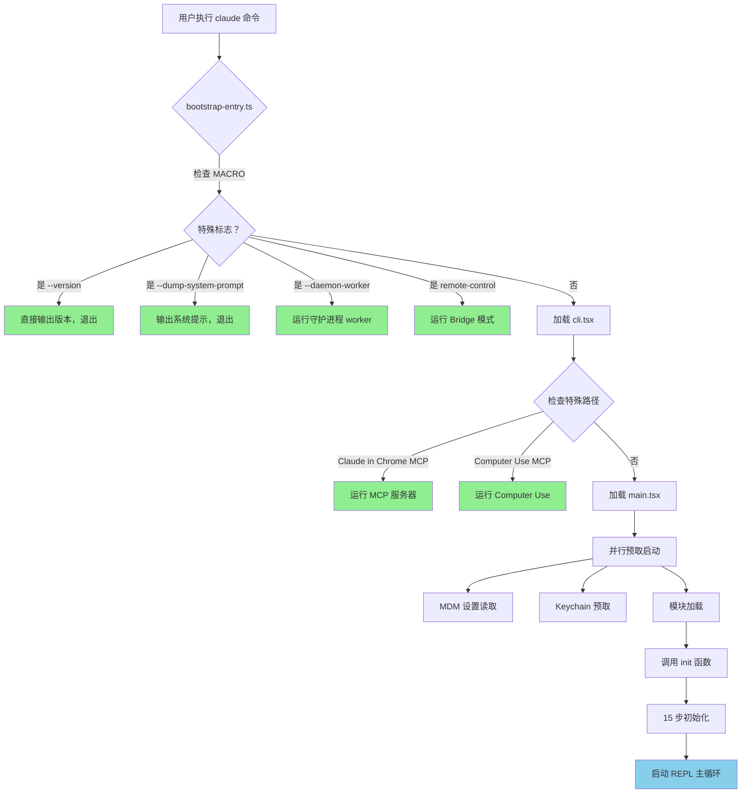
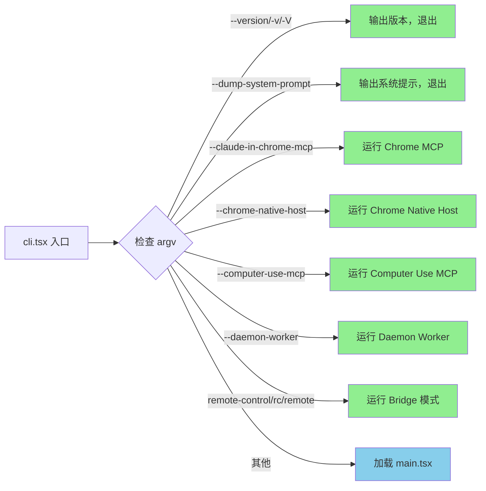
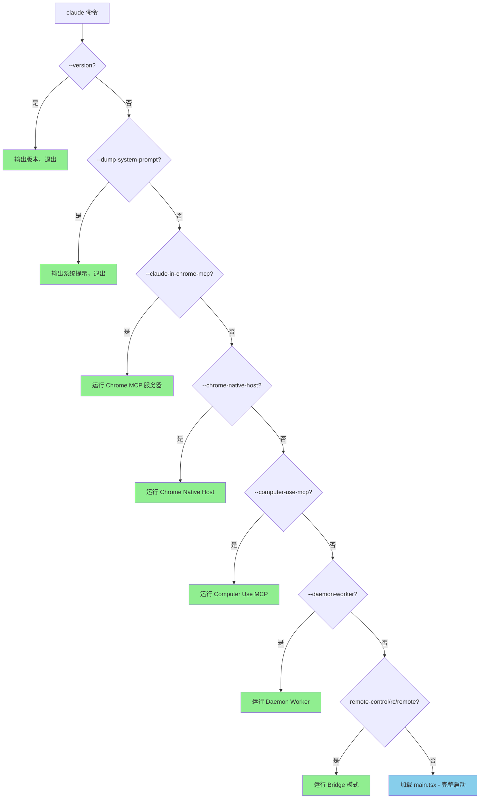
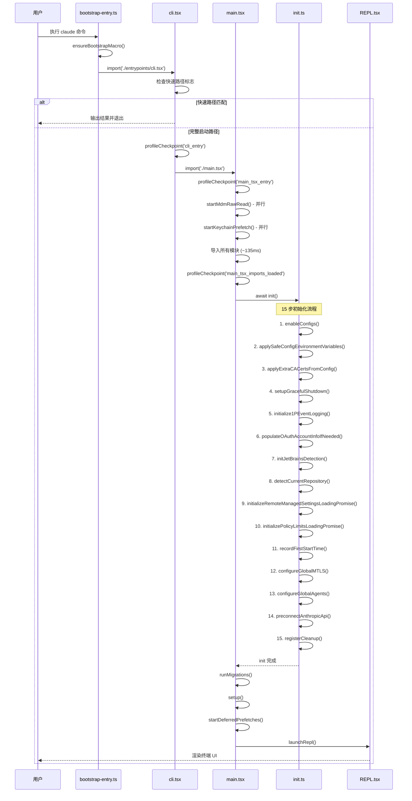
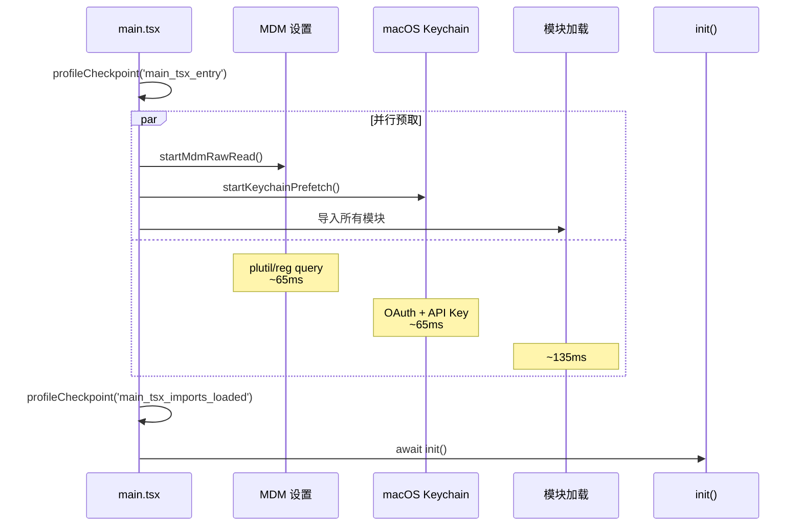
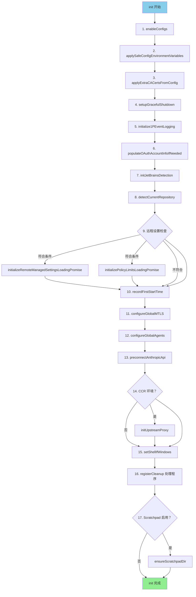

# Yao Code 启动流程详解

> 文档版本：1.0  
> 生成日期：2026-04-01  
> 基于源码：`src/bootstrap-entry.ts`, `src/entrypoints/cli.tsx`, `src/main.tsx`, `src/entrypoints/init.ts`

---

## 目录

1. [启动流程概述](#1-启动流程概述)
2. [三级启动入口架构](#2-三级启动入口架构)
3. [快速路径设计](#3-快速路径设计)
4. [完整启动流程时序图](#4-完整启动流程时序图)
5. [初始化 15 步详解](#5-初始化 15 步详解)
6. [启动性能分析](#6-启动性能分析)
7. [性能优化技术](#7-性能优化技术)

---

## 1. 启动流程概述

### 1.1 设计哲学

Claude Code 的启动流程采用**快速路径 (Fast-Path)** 设计哲学：

> **核心原则**: 常用命令应该以最小的模块加载开销快速执行，避免不必要的初始化。

这一设计带来的好处：
- `--version` 命令零模块加载，启动时间 < 10ms
- 特殊功能路径（如 MCP 服务器）只加载必需模块
- 完整 CLI 启动时，并行预取减少等待时间

### 1.2 启动流程总览



---

## 2. 三级启动入口架构

### 2.1 第一级：bootstrap-entry.ts

**文件**: `src/bootstrap-entry.ts`

这是最外层的启动入口，`package.json` 中配置：

```json
{
  "scripts": {
    "dev": "bun run ./src/bootstrap-entry.ts",
    "version": "bun run ./src/bootstrap-entry.ts --version"
  }
}
```

**核心代码**:

```typescript
// src/bootstrap-entry.ts
import pkg from '../package.json'

const defaultMacro = {
  VERSION: pkg.version,
  BUILD_TIME: '',
  PACKAGE_URL: pkg.name,
  // ...
}

export function ensureBootstrapMacro(): void {
  if (!('MACRO' in globalThis)) {
    ;(globalThis as typeof globalThis & { MACRO: typeof defaultMacro }).MACRO =
      defaultMacro
  }
}

ensureBootstrapMacro()
await import('./entrypoints/cli.tsx')
```

**职责**:
1. 设置 `MACRO.VERSION` 供 `--version` 快速路径使用
2. 导入二级入口 `cli.tsx`

---

### 2.2 第二级：cli.tsx

**文件**: `src/entrypoints/cli.tsx`

这是**快速路径决策层**，处理所有特殊标志：



**快速路径代码示例**:

```typescript
// src/entrypoints/cli.tsx:33-42
async function main(): Promise<void> {
  const args = process.argv.slice(2)

  // 快速路径：--version 零模块加载
  if (args.length === 1 && (args[0] === '--version' || args[0] === '-v' || args[0] === '-V')) {
    console.log(`${MACRO.VERSION} (Claude Code)`)
    return
  }

  // 加载启动性能分析器
  const { profileCheckpoint } = await import('../utils/startupProfiler.js')
  profileCheckpoint('cli_entry')
  
  // ... 其他快速路径检查
}
```

---

### 2.3 第三级：main.tsx

**文件**: `src/main.tsx` (~790KB)

这是**完整 CLI 启动路径**，包含：

1. 并行预取启动
2. 模块导入
3. 初始化函数调用
4. REPL 主循环

**入口代码**:

```typescript
// src/main.tsx:9-20
// 这些副作用必须在其他导入之前运行：
// 1. profileCheckpoint 在重模块评估前标记入口
// 2. startMdmRawRead 触发 MDM 子进程并行运行
// 3. startKeychainPrefetch 并行触发 macOS keychain 读取

import { profileCheckpoint, profileReport } from './utils/startupProfiler.js'

profileCheckpoint('main_tsx_entry')

import { startMdmRawRead } from './utils/settings/mdm/rawRead.js'
startMdmRawRead()

import { ensureKeychainPrefetchCompleted, startKeychainPrefetch } from './utils/secureStorage/keychainPrefetch.js'
startKeychainPrefetch()
```

---

## 3. 快速路径设计

### 3.1 快速路径列表

| 标志 | 文件路径 | 加载模块 | 用途 |
|------|----------|----------|------|
| `--version` | `cli.tsx` | 无 | 输出版本号 |
| `--dump-system-prompt` | `cli.tsx` | `config.js`, `model.js`, `prompts.js` | 输出系统提示 |
| `--claude-in-chrome-mcp` | `cli.tsx` | `mcpServer.js` | 运行 Chrome MCP 服务器 |
| `--chrome-native-host` | `cli.tsx` | `chromeNativeHost.js` | 运行 Chrome Native Host |
| `--computer-use-mcp` | `cli.tsx` | `mcpServer.js` | 运行 Computer Use MCP |
| `--daemon-worker` | `cli.tsx` | `workerRegistry.js` | 运行守护进程 worker |
| `remote-control` | `cli.tsx` | `bridgeMain.js` 等 | 运行 Bridge 模式 |

### 3.2 快速路径决策树



### 3.3 特征标志控制

快速路径使用 Bun 的 `feature()` 函数进行死代码消除：

```typescript
// src/entrypoints/cli.tsx:53-71
// Ant-only: 从外部构建中消除
if (feature('DUMP_SYSTEM_PROMPT') && args[0] === '--dump-system-prompt') {
  profileCheckpoint('cli_dump_system_prompt_path')
  const { enableConfigs } = await import('../utils/config.js')
  enableConfigs()
  const { getMainLoopModel } = await import('../utils/model/model.js')
  const modelIdx = args.indexOf('--model')
  const model = modelIdx !== -1 && args[modelIdx + 1] || getMainLoopModel()
  const { getSystemPrompt } = await import('../constants/prompts.js')
  const prompt = await getSystemPrompt([], model)
  console.log(prompt.join('\n'))
  return
}
```

---

## 4. 完整启动流程时序图

### 4.1 完整启动流程



### 4.2 并行预取时序



---

## 5. 初始化 15 步详解

### 5.1 初始化函数概览

**文件**: `src/entrypoints/init.ts`

```typescript
export const init = memoize(async (): Promise<void> => {
  const initStartTime = Date.now()
  logForDiagnosticsNoPII('info', 'init_started')
  profileCheckpoint('init_function_start')
  
  // ... 15 步初始化 ...
  
  logForDiagnosticsNoPII('info', 'init_completed', {
    duration_ms: Date.now() - initStartTime
  })
  profileCheckpoint('init_function_end')
})
```

使用 `memoize` 确保只执行一次。

---

### 5.2 步骤 1: 配置系统启用

```typescript
// init.ts:64-69
const configsStart = Date.now()
enableConfigs()
logForDiagnosticsNoPII('info', 'init_configs_enabled', {
  duration_ms: Date.now() - configsStart
})
profileCheckpoint('init_configs_enabled')
```

**职责**:
- 验证配置文件有效性
- 启用配置系统供后续使用

**耗时**: ~5ms

---

### 5.3 步骤 2: 安全环境变量应用

```typescript
// init.ts:73-84
const envVarsStart = Date.now()
applySafeConfigEnvironmentVariables()

applyExtraCACertsFromConfig()

logForDiagnosticsNoPII('info', 'init_safe_env_vars_applied', {
  duration_ms: Date.now() - envVarsStart
})
profileCheckpoint('init_safe_env_vars_applied')
```

**职责**:
- 应用**安全**的环境变量（信任对话框之前）
- 应用 `NODE_EXTRA_CA_CERTS` 到 `process.env`

**为什么需要 CA 证书配置提前？**
> Bun 通过 BoringSSL 在启动时缓存 TLS 证书存储，所以这必须在第一次 TLS 握手之前完成。

**耗时**: ~10ms

---

### 5.4 步骤 3: 优雅关闭设置

```typescript
// init.ts:87-88
setupGracefulShutdown()
profileCheckpoint('init_after_graceful_shutdown')
```

**职责**:
- 注册退出处理程序
- 确保资源正确释放

---

### 5.5 步骤 4: 遥测初始化（延迟加载）

```typescript
// init.ts:94-106
void Promise.all([
  import('../services/analytics/firstPartyEventLogger.js'),
  import('../services/analytics/growthbook.js'),
]).then(([fp, gb]) => {
  fp.initialize1PEventLogging()
  gb.onGrowthBookRefresh(() => {
    void fp.reinitialize1PEventLoggingIfConfigChanged()
  })
})
profileCheckpoint('init_after_1p_event_logging')
```

**设计亮点**:
- 使用动态导入延迟加载 ~400KB OpenTelemetry 模块
- 与后续步骤并行执行
- GrowthBook 已在模块缓存中，第二次导入无成本

**耗时**: ~50ms（并行）

---

### 5.6 步骤 5: OAuth 账户填充

```typescript
// init.ts:110-111
void populateOAuthAccountInfoIfNeeded()
profileCheckpoint('init_after_oauth_populate')
```

**职责**:
- 如果配置中未缓存，则填充 OAuth 账户信息
- 通过 VSCode 扩展登录时需要

---

### 5.7 步骤 6: JetBrains IDE 检测

```typescript
// init.ts:114-115
void initJetBrainsDetection()
profileCheckpoint('init_after_jetbrains_detection')
```

**职责**:
- 异步初始化 JetBrains IDE 检测
- 为后续同步访问填充缓存

---

### 5.8 步骤 7: Git 仓库检测

```typescript
// init.ts:118-119
void detectCurrentRepository()
```

**职责**:
- 异步检测当前 Git 仓库
- 为 `gitDiff` PR 链接功能填充缓存

---

### 5.9 步骤 8: 远程设置初始化

```typescript
// init.ts:123-129
if (isEligibleForRemoteManagedSettings()) {
  initializeRemoteManagedSettingsLoadingPromise()
}
if (isPolicyLimitsEligible()) {
  initializePolicyLimitsLoadingPromise()
}
profileCheckpoint('init_after_remote_settings_check')
```

**职责**:
- 为远程管理设置用户初始化加载 promise
- 为策略限制用户初始化加载 promise
- 包含超时防止死锁

---

### 5.10 步骤 9: 记录首次启动时间

```typescript
// init.ts:132
recordFirstStartTime()
```

---

### 5.11 步骤 10: mTLS 配置

```typescript
// init.ts:135-141
const mtlsStart = Date.now()
logForDebugging('[init] configureGlobalMTLS starting')
configureGlobalMTLS()
logForDiagnosticsNoPII('info', 'init_mtls_configured', {
  duration_ms: Date.now() - mtlsStart
})
logForDebugging('[init] configureGlobalMTLS complete')
```

**职责**:
- 配置全局 mTLS 设置
- 从配置读取客户端证书

**耗时**: ~5ms

---

### 5.12 步骤 11: 代理配置

```typescript
// init.ts:144-151
const proxyStart = Date.now()
logForDebugging('[init] configureGlobalAgents starting')
configureGlobalAgents()
logForDiagnosticsNoPII('info', 'init_proxy_configured', {
  duration_ms: Date.now() - proxyStart
})
logForDebugging('[init] configureGlobalAgents complete')
profileCheckpoint('init_network_configured')
```

**职责**:
- 配置全局 HTTP 代理
- 支持企业代理配置

**耗时**: ~5ms

---

### 5.13 步骤 12: API 预连接

```typescript
// init.ts:159
preconnectAnthropicApi()
```

**设计亮点**:
> 预连接到 Anthropic API —— 在 ~100ms 的操作处理工作期间并行完成 TCP+TLS 握手（~100-200ms）。在 CA 证书和代理代理配置完成后触发，确保预热的连接使用正确的传输配置。

**耗时**: ~0ms（fire-and-forget）

---

### 5.14 步骤 13: Upstream 代理初始化（CCR 环境）

```typescript
// init.ts:167-183
if (isEnvTruthy(process.env.CLAUDE_CODE_REMOTE)) {
  try {
    const { initUpstreamProxy, getUpstreamProxyEnv } = await import(
      '../upstreamproxy/upstreamproxy.js'
    )
    const { registerUpstreamProxyEnvFn } = await import(
      '../utils/subprocessEnv.js'
    )
    registerUpstreamProxyEnvFn(getUpstreamProxyEnv)
    await initUpstreamProxy()
  } catch (err) {
    logForDebugging('[init] upstreamproxy init failed: ...; continuing without proxy', { level: 'warn' })
  }
}
```

**职责**:
- 仅在 CCR (Claude Code Remote) 环境中启用
- 启动本地 CONNECT 中继
- 允许 agent 子进程访问组织配置的 upstream

---

### 5.15 步骤 14: Git Shell 设置（Windows）

```typescript
// init.ts:186
setShellIfWindows()
```

---

### 5.16 步骤 15: 清理处理程序注册

```typescript
// init.ts:189-200
registerCleanup(shutdownLspServerManager)

registerCleanup(async () => {
  const { cleanupSessionTeams } = await import('../utils/swarm/teamHelpers.js')
  await cleanupSessionTeams()
})
```

**职责**:
- 注册 LSP 服务器管理器关闭处理
- 注册会话团队清理处理（gh-32730 修复）

---

### 5.17: 额外步骤 - Scratchpad 目录创建

```typescript
// init.ts:203-209
if (isScratchpadEnabled()) {
  const scratchpadStart = Date.now()
  await ensureScratchpadDir()
  logForDiagnosticsNoPII('info', 'init_scratchpad_created', {
    duration_ms: Date.now() - scratchpadStart
  })
}
```

---

### 5.18: 初始化流程图



---

## 6. 启动性能分析

### 6.1 性能分析器

**文件**: `src/utils/startupProfiler.ts`

使用 Node.js `performance hooks` API 进行标准时间测量：

```typescript
// startupProfiler.ts:65-75
export function profileCheckpoint(name: string): void {
  if (!SHOULD_PROFILE) return

  const perf = getPerformance()
  perf.mark(name)

  // 仅在详细模式启用时捕获内存
  if (DETAILED_PROFILING) {
    memorySnapshots.push(process.memoryUsage())
  }
}
```

### 6.2 两种分析模式

| 模式 | 触发方式 | 输出 |
|------|----------|------|
| **采样日志** | 100% ant 用户，0.5% 外部用户 | Statsig 事件 `tengu_startup_perf` |
| **详细分析** | `CLAUDE_CODE_PROFILE_STARTUP=1` | 文件输出到 `~/.claude/startup-perf/<session-id>.txt` |

### 6.3 关键性能指标

```typescript
// startupProfiler.ts:49-54
const PHASE_DEFINITIONS = {
  import_time: ['cli_entry', 'main_tsx_imports_loaded'],
  init_time: ['init_function_start', 'init_function_end'],
  settings_time: ['eagerLoadSettings_start', 'eagerLoadSettings_end'],
  total_time: ['cli_entry', 'main_after_run'],
} as const
```

### 6.4 典型启动时间分解

```
典型启动时间分解 (非快速路径):
├── CLI 入口到 main.tsx 加载: ~10ms
├── 模块加载时间:          ~135ms
├── init 初始化时间:       ~100ms
├── setup 时间:            ~50ms
└── REPL 渲染时间:         ~100ms
    ─────────────────────────
    总计:                  ~395ms
```

### 6.5 并行优化效果

```mermaid
gantt
    title 启动流程并行优化
    dateFormat X
    axisFormat %Lms
    
    section 预取
    MDM 设置读取     :0, 65
    Keychain 预取    :0, 65
    
    section 模块加载
    模块导入         :0, 135
    
    section 初始化
    init 函数        :135, 235
    
    section 后续
    setup           :235, 285
    REPL 渲染        :285, 385
```



---

## 7. 性能优化技术

### 7.1 懒加载策略

**动态导入延迟加载重型模块**:

```typescript
// 延迟加载 ~400KB OpenTelemetry
const { initializeTelemetry } = await import(
  '../utils/telemetry/instrumentation.js'
)

// 延迟加载重型模块 (insights.ts 113KB)
const real = (await import('./commands/insights.js')).default
```

### 7.2 并行预取

**在模块加载期间并行执行 I/O 操作**:

```typescript
// main.tsx:13-20
import { startMdmRawRead } from './utils/settings/mdm/rawRead.js'
startMdmRawRead()  // 并行：MDM 设置读取

import { startKeychainPrefetch } from './utils/secureStorage/keychainPrefetch.js'
startKeychainPrefetch()  // 并行：Keychain 预取

// 同时导入模块
import { feature } from 'bun:bundle'
import { Command as CommanderCommand } from '@commander-js/extra-typings'
// ... ~135ms 的模块导入
```

### 7.3 记忆化缓存

**使用 `lodash-es/memoize` 缓存昂贵操作**:

```typescript
// init.ts:57
export const init = memoize(async (): Promise<void> => {
  // 只执行一次
})

// commands.ts:258
const COMMANDS = memoize((): Command[] => [...])
```

### 7.4 特征标志死代码消除

**使用 `feature()` 进行构建时优化**:

```typescript
// cli.tsx:53
if (feature('DUMP_SYSTEM_PROMPT') && args[0] === '--dump-system-prompt') {
  // 外部构建中，此代码块被完全消除
}
```

### 7.5 API 预连接

**在需要之前预热 TCP+TLS 连接**:

```typescript
// init.ts:159
preconnectAnthropicApi()
```

**优化原理**:
- TCP 握手: ~40ms
- TLS 握手: ~60-160ms
- 与 ~100ms 的操作处理工作并行
- 净节省: ~100ms

### 7.6 优化技术总结

| 技术 | 节省时间 | 实现位置 |
|------|----------|----------|
| 快速路径 | ~380ms | `cli.tsx` |
| 并行预取 | ~65ms | `main.tsx` |
| 懒加载 | ~50ms | 多处 |
| API 预连接 | ~100ms | `init.ts` |
| 记忆化 | 重复调用 | 多处 |

---

## 8. 错误处理

### 8.1 配置错误处理

```typescript
// init.ts:215-237
catch (error) {
  if (error instanceof ConfigParseError) {
    // 非交互式会话：直接输出错误并退出
    if (getIsNonInteractiveSession()) {
      process.stderr.write(
        `Configuration error in ${error.filePath}: ${error.message}\n`
      )
      gracefulShutdownSync(1)
      return
    }

    // 交互式会话：显示 Ink 对话框
    return import('../components/InvalidConfigDialog.js').then(m =>
      m.showInvalidConfigDialog({ error })
    )
  } else {
    // 非配置错误：重新抛出
    throw error
  }
}
```

### 8.2 遥测错误处理

```typescript
// init.ts:272-285
if (isEligibleForRemoteManagedSettings()) {
  void waitForRemoteManagedSettingsToLoad()
    .then(async () => {
      applyConfigEnvironmentVariables()
      await doInitializeTelemetry()
    })
    .catch(error => {
      logForDebugging(
        `[3P telemetry] Telemetry init failed (remote settings path): ${errorMessage(error)}`,
        { level: 'error' }
      )
    })
}
```

---

## 9. 相关文件索引

| 文件 | 行数 | 职责 |
|------|------|------|
| `src/bootstrap-entry.ts` | 29 | 第一级入口，MACRO 设置 |
| `src/entrypoints/cli.tsx` | ~400 | 快速路径决策层 |
| `src/main.tsx` | ~2000 | 完整启动，模块导入 |
| `src/entrypoints/init.ts` | 341 | 15 步初始化 |
| `src/utils/startupProfiler.ts` | 195 | 性能分析 |
| `src/bootstrap/state.ts` | - | 全局状态管理 |
| `src/utils/gracefulShutdown.js` | - | 优雅关闭 |

---

## 10. 总结

Claude Code 的启动流程是一个精心设计的**多级决策系统**：

1. **快速路径优先**: 常用命令（如 `--version`）零模块加载
2. **并行预取**: MDM 设置、Keychain、模块加载并行执行
3. **懒加载重型模块**: OpenTelemetry 等 ~400KB 模块延迟加载
4. **API 预连接**: 在需要之前预热 TCP+TLS 连接
5. **记忆化缓存**: 避免重复初始化

这些优化技术的组合使得完整启动时间控制在 ~400ms 以内，而快速路径命令可以在 <10ms 内完成。
