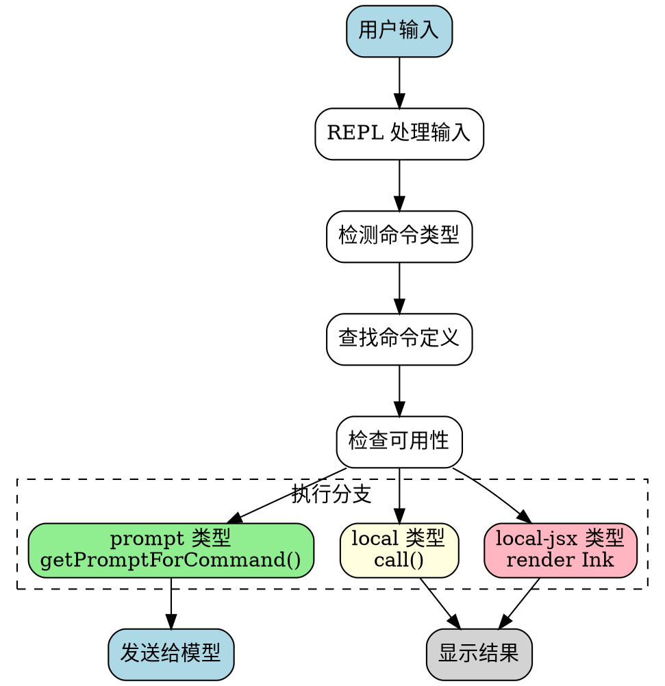

# 命令系统执行流程详解

## 概述

本文档详细描述 Yao Code 命令系统的执行流程，包括命令加载、解析、执行和结果处理的完整过程。

---

## 目录

1. [命令类型](#命令类型)
2. [命令加载流程](#命令加载流程)
3. [命令执行流程](#命令执行流程)
4. [核心命令实现](#核心命令实现)
5. [流程图](#流程图)

---

## 命令类型

命令系统支持三种类型的命令：

### 1. Prompt 类型 (`type: 'prompt'`)

- **用途**: 展开为文本提示发送给模型
- **示例**: `/skills`, `/review`, `/security-review`
- **执行**: `getPromptForCommand()` 返回文本内容

```typescript
// src/commands/help/help.tsx
export const call: LocalJSXCommandCall = async (onDone, { options: { commands } }) => {
  return <HelpV2 commands={commands} onClose={onDone} />;
};
```

### 2. Local 类型 (`type: 'local'`)

- **用途**: 本地执行产生文本输出
- **示例**: `/help`, `/version`, `/cost`
- **执行**: `call()` 函数本地执行

### 3. Local-JSX 类型 (`type: 'local-jsx'`)

- **用途**: 渲染 Ink UI 组件
- **示例**: `/config`, `/tasks`, `/memory`
- **执行**: 渲染 React/Ink 组件到终端

---

## 命令加载流程

### 完整加载链路

```
启动时
└── main.tsx
    └── init()
        └── getCommands(cwd)
            ├── loadAllCommands(cwd) [memoized]
            │   ├── Promise.all([
            │   │   ├── getSkills(cwd)
            │   │   │   ├── getSkillDirCommands()
            │   │   │   ├── getPluginSkills()
            │   │   │   ├── getBundledSkills()
            │   │   │   └── getBuiltinPluginSkills()
            │   │   ├── getPluginCommands()
            │   │   └── getWorkflowCommands()
            │   └── COMMANDS()  // 内置命令
            ├── meetsAvailabilityRequirement()  // 认证检查
            └── isCommandEnabled()              // 功能标志检查
```

### 命令来源

| 来源 | 加载位置 | 示例 |
|------|----------|------|
| `builtin` | `src/commands/` | `/help`, `/clear` |
| `bundled` | `src/skills/bundled/` | 内置技能 |
| `skills` | `./.claude/skills/` | 用户技能 |
| `plugin` | `./.claude/plugins/` | 插件命令 |
| `workflow` | 工作流脚本 | 自定义工作流 |
| `mcp` | MCP 服务器 | MCP 提供的技能 |

### 命令缓存机制

```typescript
// src/commands.ts:448-469
const loadAllCommands = memoize(async (cwd: string): Promise<Command[]> => {
  const [
    { skillDirCommands, pluginSkills, bundledSkills, builtinPluginSkills },
    pluginCommands,
    workflowCommands,
  ] = await Promise.all([
    getSkills(cwd),
    getPluginCommands(),
    getWorkflowCommands ? getWorkflowCommands(cwd) : Promise.resolve([]),
  ])

  return [
    ...bundledSkills,
    ...builtinPluginSkills,
    ...skillDirCommands,
    ...workflowCommands,
    ...pluginCommands,
    ...pluginSkills,
    ...COMMANDS(),
  ]
})
```

**缓存失效**:
- `clearCommandsCache()` - 清除所有缓存
- 文件变化检测触发重新加载

---

## 命令执行流程

### 用户输入处理

```
用户输入 "/command args"
│
▼
REPL.tsx:handleInput()
│
├─► 检测是否为命令：isSlashCommand(input)
│
├─► 查找命令：findCommand(commandName, commands)
│
├─► 检查命令可用性：isCommandEnabled(command)
│
▼
根据命令类型执行
│
├─► prompt 类型
│   └─► getPromptForCommand(args, context)
│       └─► 返回文本 → 追加到消息 → 发送给模型
│
├─► local 类型
│   └─► call(onDone, context)
│       └─► 执行本地逻辑 → 显示结果
│
└─► local-jsx 类型
    └─► call(onDone, context)
        └─► 渲染 Ink 组件 → 显示 UI
```

### 详细执行流程



---

## 核心命令实现

### 1. Help 命令 (`/help`)

**文件**: `src/commands/help/help.tsx`

```typescript
import * as React from 'react';
import { HelpV2 } from '../../components/HelpV2/HelpV2.js';
import type { LocalJSXCommandCall } from '../../types/command.js';

export const call: LocalJSXCommandCall = async (
  onDone,
  { options: { commands } }
) => {
  return <HelpV2 commands={commands} onClose={onDone} />;
};
```

**执行流程**:
1. 用户输入 `/help`
2. REPL 识别为 local-jsx 类型
3. 渲染 `HelpV2` 组件
4. 显示命令列表和说明

### 2. Clear 命令 (`/clear`)

**文件**: `src/commands/clear/clear.ts`

```typescript
export default {
  type: 'local',
  name: 'clear',
  description: '清除对话历史',
  async call(onDone, context) {
    // 清除消息历史
    context.setAppState(prev => ({
      ...prev,
      messages: []
    }));
    onDone();
  }
}
```

### 3. Skills 命令 (`/skills`)

**文件**: `src/commands/skills/skills.tsx`

```typescript
// prompt 类型命令
export default {
  type: 'prompt',
  name: 'skills',
  description: '列出和使用技能',
  async getPromptForCommand(args, context) {
    const skills = await getSkillToolCommands(context.cwd);
    return `可用技能:\n${skills.map(s => `- ${s.name}: ${s.description}`).join('\n')}`;
  }
}
```

---

## 流程图

### 命令系统整体架构

```
┌─────────────────────────────────────────────────────────────────┐
│                        命令系统架构                              │
├─────────────────────────────────────────────────────────────────┤
│                                                                 │
│  ┌──────────────┐  ┌──────────────┐  ┌──────────────┐         │
│  │  内置命令    │  │  技能命令    │  │  插件命令    │         │
│  │  (builtin)   │  │  (skills)    │  │  (plugin)    │         │
│  └──────┬───────┘  └──────┬───────┘  └──────┬───────┘         │
│         │                 │                 │                  │
│         └─────────────────┼─────────────────┘                  │
│                           │                                    │
│                    ┌──────▼───────┐                           │
│                    │  命令注册表   │                           │
│                    │  commands.ts │                           │
│                    └──────┬───────┘                           │
│                           │                                    │
│         ┌─────────────────┼─────────────────┐                 │
│         │                 │                 │                  │
│  ┌──────▼───────┐  ┌──────▼───────┐  ┌──────▼───────┐         │
│  │  getCommands │  │  findCommand │  │  isCommand   │         │
│  │              │  │              │  │  Enabled     │         │
│  └──────────────┘  └──────────────┘  └──────────────┘         │
│                                                                 │
└─────────────────────────────────────────────────────────────────┘
```

### 命令加载时序图

```
┌─────┐  ┌───────────┐  ┌─────────────┐  ┌───────────┐  ┌──────────┐
│启动 │  │main.tsx   │  │commands.ts  │  │skills/    │  │plugins/  │
└──┬──┘  └─────┬─────┘  └──────┬──────┘  └─────┬─────┘  └────┬─────┘
   │          │                │               │              │
   │ 调用 init │                │               │              │
   │─────────>│                │               │              │
   │          │                │               │              │
   │          │ getCommands()  │               │              │
   │          │───────────────>│               │              │
   │          │                │               │              │
   │          │ loadAllCommands()              │              │
   │          │───────────────>│               │              │
   │          │                │               │              │
   │          │ Promise.all([  │               │              │
   │          │   getSkills,   │               │              │
   │          │   getPluginCmds,               │              │
   │          │   getWorkflowCmds              │              │
   │          │ ])           │               │              │
   │          │───────────────┼──────────────>│              │
   │          │                │               │              │
   │          │                │───────────────┼─────────────>│
   │          │                │               │              │
   │          │<───────────────┼───────────────│              │
   │          │                │               │              │
   │          │<───────────────┼───────────────│              │
   │          │                │               │              │
   │          │ 合并命令列表  │               │              │
   │          │───────────────>│               │              │
   │          │                │               │              │
   │          │ 返回命令数组  │               │              │
   │          │<───────────────│               │              │
   │          │                │               │              │
   │ 完成初始化 │                │               │              │
   │<─────────│                │               │              │
   │          │                │               │              │
```

### 远程模式命令过滤

```typescript
// src/commands.ts:619-637
export const REMOTE_SAFE_COMMANDS: Set<Command> = new Set([
  session,    // 显示二维码/URL
  exit,       // 退出 TUI
  clear,      // 清除屏幕
  help,       // 显示帮助
  theme,      // 更改主题
  color,      // 更改代理颜色
  vim,        // 切换 vim 模式
  cost,       // 显示会话成本
  usage,      // 显示使用信息
  copy,       // 复制最后消息
  btw,        // 快速笔记
  feedback,   // 发送反馈
  plan,       // 计划模式切换
  keybindings,// 键位管理
  statusline, // 状态行切换
  stickers,   // 贴纸
  mobile,     // 移动端二维码
])

// 过滤函数
export function filterCommandsForRemoteMode(commands: Command[]): Command[] {
  return commands.filter(cmd => REMOTE_SAFE_COMMANDS.has(cmd))
}
```

---

## 特殊命令处理

### 桥接模式安全命令

```typescript
// BRIDGE_SAFE_COMMANDS - 可通过远程桥接执行的 local 类型命令
export const BRIDGE_SAFE_COMMANDS: Set<Command> = new Set([
  compact,      // 压缩上下文
  clear,        // 清除记录
  cost,         // 显示成本
  summary,      // 总结对话
  releaseNotes, // 显示更新日志
  files,        // 列出文件
])

// 桥接安全检查
export function isBridgeSafeCommand(cmd: Command): boolean {
  if (cmd.type === 'local-jsx') return false  // JSX 命令被阻止
  if (cmd.type === 'prompt') return true      // prompt 类型安全
  return BRIDGE_SAFE_COMMANDS.has(cmd)        // local 类型需要检查
}
```

### 动态技能注入

```typescript
// src/commands.ts:476-517
export async function getCommands(cwd: string): Promise<Command[]> {
  const allCommands = await loadAllCommands(cwd)
  
  // 获取动态发现的技能
  const dynamicSkills = getDynamicSkills()
  
  // 构建基础命令列表
  const baseCommands = allCommands.filter(
    _ => meetsAvailabilityRequirement(_) && isCommandEnabled(_)
  )
  
  if (dynamicSkills.length === 0) {
    return baseCommands
  }
  
  // 去重动态技能
  const baseCommandNames = new Set(baseCommands.map(c => c.name))
  const uniqueDynamicSkills = dynamicSkills.filter(
    s => !baseCommandNames.has(s.name) &&
         meetsAvailabilityRequirement(s) &&
         isCommandEnabled(s)
  )
  
  if (uniqueDynamicSkills.length === 0) {
    return baseCommands
  }
  
  // 插入动态技能到插件命令之后，内置命令之前
  const builtInNames = new Set(COMMANDS().map(c => c.name))
  const insertIndex = baseCommands.findIndex(c => builtInNames.has(c.name))
  
  if (insertIndex === -1) {
    return [...baseCommands, ...uniqueDynamicSkills]
  }
  
  return [
    ...baseCommands.slice(0, insertIndex),
    ...uniqueDynamicSkills,
    ...baseCommands.slice(insertIndex),
  ]
}
```

---

## 命令缓存管理

### 缓存清除

```typescript
// src/commands.ts:523-539
export function clearCommandMemoizationCaches(): void {
  loadAllCommands.cache?.clear?.()
  getSkillToolCommands.cache?.clear?.()
  getSlashCommandToolSkills.cache?.clear?.()
  clearSkillIndexCache?.()  // 清除技能搜索缓存
}

export function clearCommandsCache(): void {
  clearCommandMemoizationCaches()
  clearPluginCommandCache()
  clearPluginSkillsCache()
  clearSkillCaches()
}
```

### 缓存触发条件

| 触发条件 | 缓存操作 |
|----------|----------|
| 技能文件变化 | `clearSkillCaches()` |
| 插件安装/卸载 | `clearPluginCommandCache()` |
| 工作流脚本变化 | `getWorkflowCommands()` 重新加载 |
| 设置变化 | `clearCommandsCache()` |

---

## 相关文件索引

| 文件 | 内容 |
|------|------|
| `src/commands.ts` | 命令注册表和核心逻辑 |
| `src/types/command.ts` | 命令类型定义 |
| `src/commands/help/help.tsx` | Help 命令实现 |
| `src/commands/clear/clear.ts` | Clear 命令实现 |
| `src/commands/skills/skills.tsx` | Skills 命令实现 |
| `src/replLauncher.tsx` | REPL 启动和输入处理 |

---

*文档生成时间：2026-04-01*
