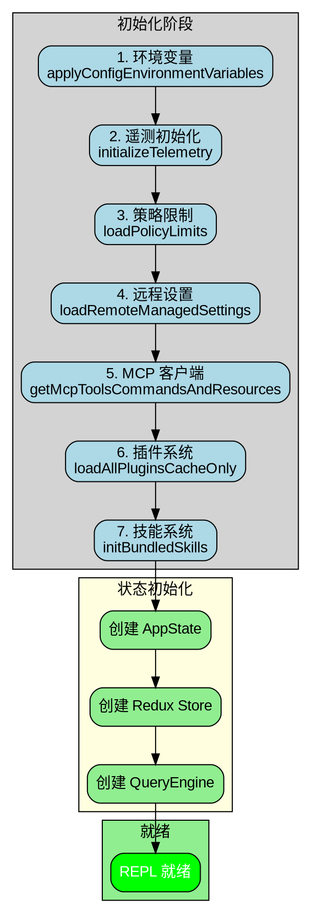
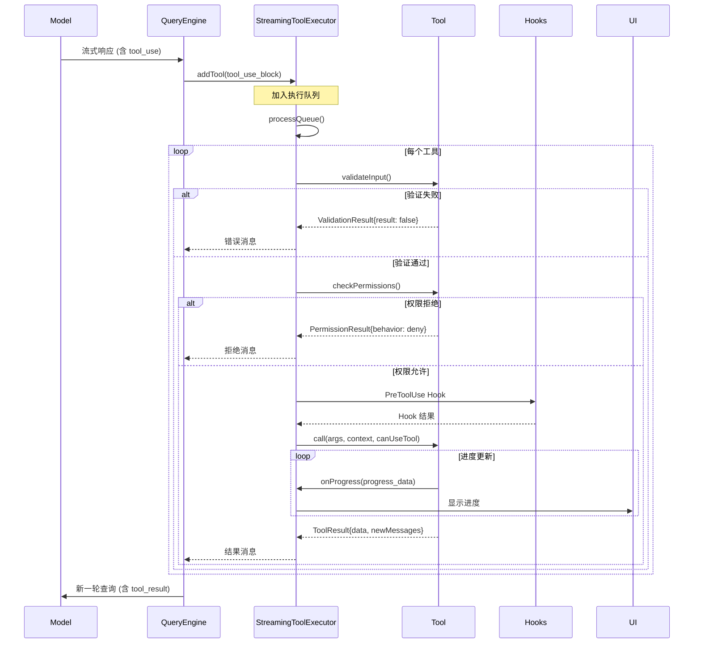
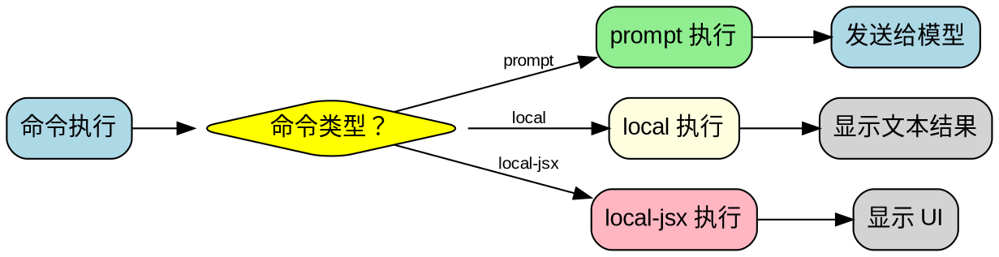
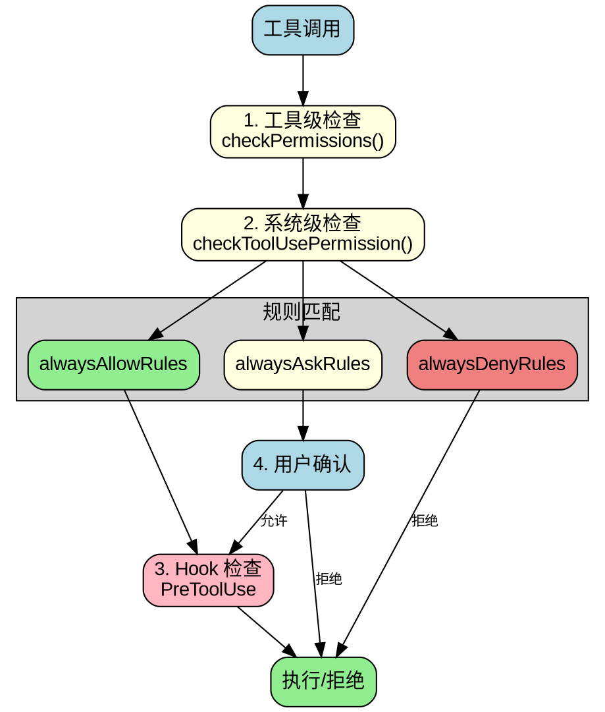

# Claude Code 执行流程图集

## 概述

本文档包含 Claude Code 工具系统和命令系统的详细流程图和调用时序图。

---

## 目录

1. [系统启动流程](#系统启动流程)
2. [工具执行流程](#工具执行流程)
3. [命令执行流程](#命令执行流程)
4. [权限检查流程](#权限检查流程)
5. [消息处理流程](#消息处理流程)

---

## 系统启动流程

### 完整启动序列

```
┌─────────────────────────────────────────────────────────────────────────────┐
│                           Claude Code 启动流程                               │
└─────────────────────────────────────────────────────────────────────────────┘

                                    │
                                    ▼
                    ┌───────────────────────────────┐
                    │   src/bootstrap-entry.ts      │
                    │   (启动入口点)                │
                    └───────────────┬───────────────┘
                                    │
            ┌───────────────────────┼───────────────────────┐
            │                       │                       │
            ▼                       ▼                       ▼
    ┌───────────────┐       ┌───────────────┐       ┌───────────────┐
    │ --version     │       │ --daemon      │       │ 完整 CLI 加载  │
    │ 快速路径      │       │ 快速路径      │       │               │
    └───────────────┘       └───────────────┘       └───────┬───────┘
                                                            │
                                                            ▼
                    ┌───────────────────────────────────────────────────────┐
                    │              src/entrypoints/cli.tsx                  │
                    │  - 设置环境变量                                       │
                    │  - 设置特征标志                                       │
                    │  - 初始化遥测                                         │
                    └───────────────────────────┬───────────────────────────┘
                                                │
                                                ▼
                    ┌───────────────────────────────────────────────────────┐
                    │                src/main.tsx                           │
                    │  - 解析 CLI 参数                                      │
                    │  - 初始化配置系统                                     │
                    │  - 加载 MCP 服务器                                    │
                    │  - 初始化插件系统                                     │
                    │  - 初始化技能系统                                     │
                    └───────────────────────────┬───────────────────────────┘
                                                │
                                                ▼
                    ┌───────────────────────────────────────────────────────┐
                    │              launchRepl()                             │
                    │  - 创建 React Ink 渲染树                              │
                    │  - 初始化 QueryEngine                                 │
                    │  - 启动 REPL 循环                                     │
                    └───────────────────────────┬───────────────────────────┘
                                                │
                                                ▼
                                    ┌───────────────────────┐
                                    │   REPL 就绪，等待输入  │
                                    └───────────────────────┘
```

### 初始化详细流程



---

## 工具执行流程

### 完整工具执行生命周期

```
┌─────────────────────────────────────────────────────────────────────────────┐
│                          工具执行完整生命周期                               │
└─────────────────────────────────────────────────────────────────────────────┘

  ┌─────────┐
  │ 模型响应 │
  │ 含 tool_use│
  └────┬────┘
       │
       ▼
  ┌─────────────────────────────────────────────────────────────────────────┐
  │  1. 流式解析 (StreamingToolExecutor.addTool)                            │
  │     - 解析 tool_use 块                                                   │
  │     - 查找工具定义                                                       │
  │     - 添加入执行队列                                                     │
  └─────────────────────────────────────────────────────────────────────────┘
       │
       ▼
  ┌─────────────────────────────────────────────────────────────────────────┐
  │  2. 队列处理 (processQueue)                                             │
  │     - 检查并发安全性                                                     │
  │     - 决定执行顺序                                                       │
  └─────────────────────────────────────────────────────────────────────────┘
       │
       ├──────────────────┬──────────────────┐
       │                  │                  │
       ▼                  ▼                  ▼
  ┌──────────┐      ┌──────────┐      ┌──────────┐
  │ 并发安全  │      │ 非并发   │      │ 未知工具  │
  │ 并行执行  │      │ 串行执行  │      │ 返回错误  │
  └────┬─────┘      └────┬─────┘      └────┬─────┘
       │                 │                 │
       └─────────────────┴─────────────────┘
                         │
                         ▼
  ┌─────────────────────────────────────────────────────────────────────────┐
  │  3. 执行前检查 (runToolUse)                                             │
  │     a) validateInput()  - 验证输入参数                                  │
  │     b) checkPermissions() - 检查权限                                    │
  │     c) canUseTool() - 最终确认 (含 Hook 检查)                           │
  └─────────────────────────────────────────────────────────────────────────┘
                         │
                    ┌────┴────┐
                    │  检查   │
                    │  通过？ │
                    └────┬────┘
                         │
           ┌─────────────┼─────────────┐
           │ NO          │ YES         │
           ▼             │             ▼
  ┌─────────────┐        │    ┌────────────────────────────────────────┐
  │ 返回错误    │        │    │  4. 执行工具 (tool.call)               │
  │ tool_result │        │    │     - 执行实际逻辑                     │
  │ is_error=true│       │    │     - 发送进度更新 (onProgress)        │
  └─────────────┘        │    │     - 处理文件操作/网络请求等          │
                         │    └────────────────────────────────────────┘
                         │                 │
                         │                 ▼
                         │    ┌────────────────────────────────────────┐
                         │    │  5. 生成结果消息                        │
                         │    │     - 创建 tool_result                 │
                         │    │     - 附加输出内容                      │
                         │    │     - 更新文件历史                      │
                         │    └────────────────────────────────────────┘
                         │                 │
                         └─────────────────┘
                                           │
                                           ▼
  ┌─────────────────────────────────────────────────────────────────────────┐
  │  6. 结果处理                                                            │
  │     - 追加到消息历史                                                     │
  │     - 触发下一轮查询                                                     │
  │     - 更新 UI 显示                                                       │
  └─────────────────────────────────────────────────────────────────────────┘
```

### 工具并发执行策略

```
┌─────────────────────────────────────────────────────────────────┐
│                    工具并发执行策略                              │
└─────────────────────────────────────────────────────────────────┘

输入：[Bash(ls), Read(file.txt), Bash(rm temp), Glob(**/*.ts)]

Step 1: 分区 (partitionToolCalls)
┌─────────────────────────────────────────────────────────────────┐
│ Batch 1 (并发安全): Bash(ls), Read(file.txt), Glob(**/*.ts)    │
│ Batch 2 (非并发):   Bash(rm temp)                               │
└─────────────────────────────────────────────────────────────────┘

Step 2: 执行 Batch 1 (并行)
┌─────────────────────────────────────────────────────────────────┐
│ Bash(ls) ──────────────────┐                                    │
│ Read(file.txt) ────────────┼──→ Promise.all()                  │
│ Glob(**/*.ts) ─────────────┘                                    │
│                                                                  │
│ 结果按原始顺序收集                                                │
└─────────────────────────────────────────────────────────────────┘

Step 3: 执行 Batch 2 (串行)
┌─────────────────────────────────────────────────────────────────┐
│ Bash(rm temp) ───────────────────────────────────────────────► │
│ (等待完成)                                                       │
└─────────────────────────────────────────────────────────────────┘
```

### 工具执行时序图 (Mermaid)



---

## 命令执行流程

### 命令执行完整流程

```
┌─────────────────────────────────────────────────────────────────────────────┐
│                           命令执行完整流程                                   │
└─────────────────────────────────────────────────────────────────────────────┘

用户输入：/command args

Step 1: 输入识别
┌─────────────────────────────────────────────────────────────────────────────┐
│ REPL.tsx:handleInput()                                                      │
│   - 检测斜杠前缀                                                            │
│   - 提取命令名称和参数                                                       │
│   - 查找命令定义：findCommand(name, commands)                               │
└─────────────────────────────────────────────────────────────────────────────┘
                                      │
                                      ▼
Step 2: 命令验证
┌─────────────────────────────────────────────────────────────────────────────┐
│   - 检查命令是否存在                                                         │
│   - 检查命令是否可用：meetsAvailabilityRequirement()                        │
│   - 检查命令是否启用：isCommandEnabled()                                    │
└─────────────────────────────────────────────────────────────────────────────┘
                                      │
                                      ▼
Step 3: 根据类型执行
┌─────────────────────────────────────────────────────────────────────────────┐
│ ┌─────────────────────────────────────────────────────────────────────────┐ │
│ │ prompt 类型                                                              │ │
│ │   → getPromptForCommand(args, context)                                  │ │
│ │   → 返回文本内容                                                         │ │
│ │   → 追加到消息 → 发送给模型                                              │ │
│ └─────────────────────────────────────────────────────────────────────────┘ │
│                                                                             │
│ ┌─────────────────────────────────────────────────────────────────────────┐ │
│ │ local 类型                                                               │ │
│ │   → call(onDone, context)                                               │ │
│ │   → 执行本地逻辑                                                         │ │
│ │   → 输出文本结果                                                         │ │
│ └─────────────────────────────────────────────────────────────────────────┘ │
│                                                                             │
│ ┌─────────────────────────────────────────────────────────────────────────┐ │
│ │ local-jsx 类型                                                           │ │
│ │   → call(onDone, context)                                               │ │
│ │   → 渲染 Ink 组件                                                        │ │
│ │   → 显示交互式 UI                                                        │ │
│ └─────────────────────────────────────────────────────────────────────────┘ │
└─────────────────────────────────────────────────────────────────────────────┘
                                      │
                                      ▼
Step 4: 结果显示
┌─────────────────────────────────────────────────────────────────────────────┐
│   - 更新 UI 显示                                                             │
│   - 调用 onDone() 完成回调                                                   │
└─────────────────────────────────────────────────────────────────────────────┘
```

### 命令类型决策树



---

## 权限检查流程

### 工具权限检查详细流程

```
┌─────────────────────────────────────────────────────────────────────────────┐
│                          工具权限检查流程                                    │
└─────────────────────────────────────────────────────────────────────────────┘

工具调用：Bash(rm -rf /tmp/cache)

Step 1: 工具级权限检查 (checkPermissions)
┌─────────────────────────────────────────────────────────────────────────────┐
│ BashTool.checkPermissions(input, context)                                   │
│   - 解析命令内容                                                             │
│   - 检查是否包含危险操作                                                      │
│   - 检查路径是否在允许范围内                                                  │
│   - 返回 PermissionResult                                                   │
└─────────────────────────────────────────────────────────────────────────────┘
                                      │
                                      ▼
Step 2: 系统级权限检查 (permissions.ts)
┌─────────────────────────────────────────────────────────────────────────────┐
│ checkToolUsePermission()                                                    │
│   - 检查 alwaysAllowRules                                                    │
│   - 检查 alwaysDenyRules                                                     │
│   - 检查 alwaysAskRules                                                      │
│   - 匹配 Hook 规则                                                           │
└─────────────────────────────────────────────────────────────────────────────┘
                                      │
                    ┌─────────────────┼─────────────────┐
                    │                 │                 │
                    ▼                 ▼                 ▼
            ┌──────────────┐  ┌──────────────┐  ┌──────────────┐
            │   Allow      │  │    Deny      │  │    Ask       │
            │  (自动允许)   │  │  (自动拒绝)   │  │  (询问用户)   │
            └──────────────┘  └──────────────┘  └──────┬───────┘
                                                       │
                                                       ▼
                                            ┌──────────────────┐
                                            │  显示权限对话框   │
                                            │  用户选择        │
                                            └──────────────────┘
                                                       │
                              ┌────────────────────────┼────────────────────────┐
                              │                        │                        │
                              ▼                        ▼                        ▼
                      ┌──────────────┐         ┌──────────────┐         ┌──────────────┐
                      │  允许本次     │         │  总是允许    │         │   拒绝       │
                      └──────────────┘         └──────────────┘         └──────────────┘
```

### 权限规则匹配流程



---

## 消息处理流程

### 消息规范化流程

```
┌─────────────────────────────────────────────────────────────────────────────┐
│                          消息规范化流程 (normalizeMessagesForAPI)           │
└─────────────────────────────────────────────────────────────────────────────┘

输入消息历史:
[User, Assistant(tool_use), Progress, System, Assistant, User, ...]

Step 1: 过滤消息
┌─────────────────────────────────────────────────────────────────────────────┐
│   - 移除 Progress 消息                                                       │
│   - 移除 System 消息 (某些类型)                                              │
│   - 移除 Hook 结果消息                                                       │
│   - 保留 User, Assistant, Attachment 消息                                   │
└─────────────────────────────────────────────────────────────────────────────┘
                                      │
                                      ▼
Step 2: 转换消息格式
┌─────────────────────────────────────────────────────────────────────────────┐
│ User 消息:                                                                   │
│   { type: 'user', message: { content: [...] } }                             │
│   → ContentBlockParam[]                                                      │
│                                                                              │
│ Assistant 消息:                                                               │
│   { type: 'assistant', message: { content: [...] } }                        │
│   → ContentBlockParam[] (text, tool_use)                                    │
└─────────────────────────────────────────────────────────────────────────────┘
                                      │
                                      ▼
Step 3: 添加上下文
┌─────────────────────────────────────────────────────────────────────────────┐
│   - prependUserContext(): 添加用户上下文                                     │
│   - appendSystemContext(): 添加系统上下文                                    │
└─────────────────────────────────────────────────────────────────────────────┘
                                      │
                                      ▼
输出：API 请求格式的消息数组
```

### 消息类型映射

```
┌─────────────────────────────────────────────────────────────────────────────┐
│                        消息类型映射表                                        │
└─────────────────────────────────────────────────────────────────────────────┘

内部消息类型                    API 消息类型
─────────────────────────────────────────────────────────────────────────────
UserMessage                  →  user (content: [...])
AssistantMessage             →  assistant (content: [...])
ProgressMessage              →  [过滤掉，不发送给 API]
SystemMessage                →  [大部分过滤，某些转换为 user 系统消息]
AttachmentMessage            →  user (content: [{type: 'image', ...}])
HookResultMessage            →  [过滤掉]
ToolUseSummaryMessage        →  [过滤掉]
TombstoneMessage             →  [过滤掉]
GroupedToolUseMessage        →  [过滤掉]
```

---

## 相关文件索引

| 文件 | 内容 |
|------|------|
| `src/bootstrap-entry.ts` | 启动入口点 |
| `src/entrypoints/cli.tsx` | CLI 入口 |
| `src/main.tsx` | 主程序 |
| `src/query.ts` | 查询执行核心 |
| `src/QueryEngine.ts` | 查询引擎类 |
| `src/services/tools/toolOrchestration.ts` | 工具编排 |
| `src/services/tools/toolExecution.ts` | 工具执行 |
| `src/services/tools/StreamingToolExecutor.ts` | 流式执行器 |
| `src/utils/permissions/permissions.ts` | 权限检查 |
| `src/utils/messages.js` | 消息处理 |
| `src/commands.ts` | 命令注册表 |
| `src/replLauncher.tsx` | REPL 启动 |

---

*文档生成时间：2026-04-01*
